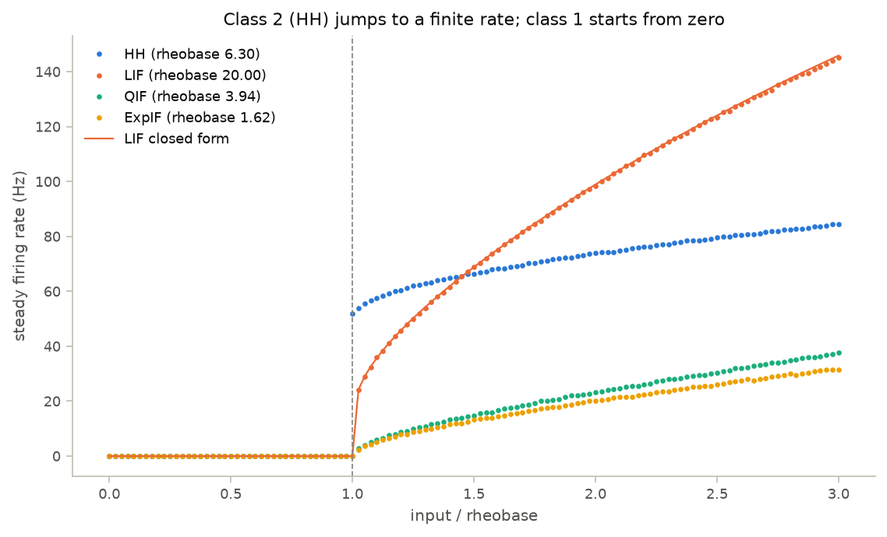

# BrainPy Neural Modeling Notes

Worked implementations of the neural-modeling course behind
*神经计算建模实战：基于BrainPy* (*Neural Computational Modeling in Practice:
Based on BrainPy*, Wang Chaoming, 2023): neurons, synapses, networks, and
training, each written out from its equations in [BrainPy](https://github.com/brainpy/BrainPy),
checked against closed-form results or an independent implementation, and
summarized in a study note.

## Course map

| day | topic | code | notes | headline result |
|---|---|---|---|---|
| 1 | BrainPy basics: integrators, JIT | [`basics.py`](neuromodels/basics.py) | [01](notes/01_brainpy_basics.md) | Euler, Heun, RK4 converge at orders 1.00, 1.95, 3.95; JIT runs ≈1270× faster |
| 2 | Hodgkin–Huxley model | [`neurons.py`](neuromodels/neurons.py) | [02](notes/02_hodgkin_huxley.md) | firing starts at 6.3 µA/cm² at 51 Hz (class 2); rest stays stable up to a subcritical Hopf at 9.78, so the two coexist in between |
| 3 | Reduced models: LIF, QIF, ExpIF, AdEx, Izhikevich | [`neurons.py`](neuromodels/neurons.py) | [03](notes/03_reduced_models.md) | closed-form rheobases and LIF rates match simulation; seven Izhikevich cell types from four parameters |
| 3 | Dynamics analysis: phase planes, bifurcations | [`analysis.py`](neuromodels/analysis.py) | [04](notes/04_dynamics_analysis.md) | a saddle-node gives firing from 0 Hz, a Hopf point a finite onset rate; both "regular spiking" fits are Hopf-type |
| 4 | Synapses: kinetics, AMPA/GABA_A/NMDA, current- vs conductance-based | [`synapses.py`](neuromodels/synapses.py) | [05](notes/05_synapses.md) | a conductance-based EPSP scales exactly with the driving force; NMDA saturates (5 spikes reach 0.92, not the linear 2.52) |
| 4 | Plasticity: short-term, STDP, Oja, BCM | [`plasticity.py`](neuromodels/plasticity.py) | [06](notes/06_plasticity.md) | short-term release matches its closed-form steady state to 10⁻¹³; STDP splits weights to the bounds; Oja finds the unit eigenvector, BCM a selective state |
| 5 | E/I balanced network (COBA benchmark) | [`networks/ei_balance.py`](neuromodels/networks/ei_balance.py) | [07](notes/07_ei_balance.md) | 4000 neurons fire asynchronously and irregularly (ISI CV 1.70) because inhibition cancels 93 % of the excitation; without it they synchronize |
| 5–6 | Decision making (Wong & Wang 2006, spiking Wang 2002) | [`networks/decision.py`](neuromodels/networks/decision.py) | [08](notes/08_decision_making.md) | psychometric and chronometric curves with slower errors; the stimulus turns rest into a saddle between two choice attractors |
| 6 | Continuous attractor network | [`networks/cann.py`](neuromodels/networks/cann.py) | [09](notes/09_cann.md) | bump height matches Wu et al. (2008) to 7×10⁻⁹; the bump persists below the critical inhibition and decays above it |
| 6 | Reservoir computing (echo state network) | [`networks/reservoir.py`](neuromodels/networks/reservoir.py) | [10](notes/10_reservoir.md) | Mackey–Glass forecast error 2.7×10⁻⁴ one step and 0.023 at 84 steps ahead; the echo-state property fails as the spectral radius grows |
| 7 | Training a rate RNN (BPTT) | [`training/rnn.py`](neuromodels/training/rnn.py) | [11](notes/11_rnn_training.md) | reaches the Bayes loss floor (0.116 vs 0.115) and the ideal observer's accuracy (0.758 vs 0.765) |
| 7 | Training a spiking network (surrogate gradients) | [`training/snn.py`](neuromodels/training/snn.py) | [12](notes/12_snn_training.md) | 98.6 % on patterns that differ only in spike timing; with the true spike derivative the input weights get exactly zero gradient |

Each chapter has a script in [`scripts/`](scripts) that saves its figures to
[`outputs/`](outputs) and prints its key numbers.



## How the results are checked

Every model has tests in [`tests/`](tests): 129 of them, about 1.5 minutes on a
4-core CPU with `pytest`. The tests compare simulations against one of three
references rather than against numbers saved from an earlier run:

- **a closed form**: the exact LIF period, saddle-node and Hopf points, integrator
  convergence orders, the exact solution of a linear ODE;
- **an independent implementation**: each hand-written neuron class against
  BrainPy's built-in model (agreement to 10⁻⁹ mV), and the BrainPy Izhikevich
  neuron against the dependency-free NumPy demo, spike for spike;
- **a property the theory predicts**, with the reason in a comment: spike-frequency
  adaptation, anode-break excitation, bistability below a subcritical Hopf point.

## Pitfalls found along the way

Working through the course against the current BrainPy release (2.8.2) turned up
behavior that silently changes results:

- `bp.dyn.HH` defaults to a leak of 0.03 mS/cm², a tenth of Hodgkin & Huxley's
  0.3. Rest moves from −65 to −70.7 mV and anode-break excitation disappears.
- `bp.dyn.ExpIF` and `bp.dyn.AdExIF` default to a −55 mV spike cutoff (their
  docstrings say −30 mV), only 1.4 Δ_T above V_T, which clips the upswing.
- The built-in integrate-and-fire models start at 0 mV, above threshold for
  biological parameter sets.
- `bp.DSRunner` labels each sample with the start of its step but stores the
  state at the end; `bp.IntegratorRunner` labels with the end. It also leaves
  BrainPy's global `dt` changed after a run. [`neuromodels.utils.run`](neuromodels/utils.py)
  returns aligned times and restores `dt`.
- `bp.dyn.Alpha` peaks at 1/e rather than 1, `bp.dyn.DualExpon`'s default
  integrator overshoots its peak by 5 % at dt = 0.1 ms, and `bp.dyn.STP` starts
  its utilization at U instead of 0.
- BrainPy computes in float32 unless `bm.enable_x64()` is called; the tests run
  in float64.
- Event-driven sparse projections (`bp.dnn.EventCSRLinear`) need Numba on CPU.
  Without it they fail to compile, so the E/I network switches `brainevent` to
  its pure-JAX kernels.

## Quick start

Tested with Python 3.11 on CPU.

```bash
python -m venv .venv
source .venv/bin/activate
pip install -r requirements.txt   # pinned BrainPy/JAX, plus this repo in editable mode
pytest                            # every chapter's checks
python scripts/02_hodgkin_huxley.py
```

The original dependency-light demo still runs on NumPy and Matplotlib alone:

```bash
python izhikevich_demo.py
```

```text
Simulated 1000 time steps
Spike count: 4
Saved plot: outputs/izhikevich_voltage_trace.png
```

## Repository layout

```text
neuromodels/        models and analysis, one module per course topic
  utils.py          run helper with aligned time stamps, inputs, spike statistics, figure style
  networks/         network models (days 5–6)
  training/         RNN and spiking-network training (day 7)
scripts/            one script per chapter; figures go to outputs/
tests/              checks against closed forms, BrainPy built-ins, and theory
notes/              study notes: equations, parameters, findings, open questions
izhikevich_demo.py  NumPy-only Izhikevich neuron, the repo's first reproducible demo
examples.ipynb      exploratory notebook (see below)
```

`examples.ipynb` explores a need-based energy-landscape model of thirst and
hunger. It imports a `model_functions` module that is not in this repository,
so it does not run as-is.

## History

- **June 2025**: repository created; exploratory notebook added.
- **April 2026**: README and the NumPy Izhikevich demo.
- **September 2026**: full pass through the course: the `neuromodels` package,
  chapter scripts, tests, and study notes.

## Limitations

- Single-compartment models only: no dendrites, axons, or cable equation.
- Parameters follow the cited papers, but the papers themselves were not at hand
  for every chapter; each note flags the values it could not check. Nothing here
  is fitted to recordings.
- Results are checked on CPU with the pinned versions; other BrainPy releases
  may differ (see the pitfalls above).
