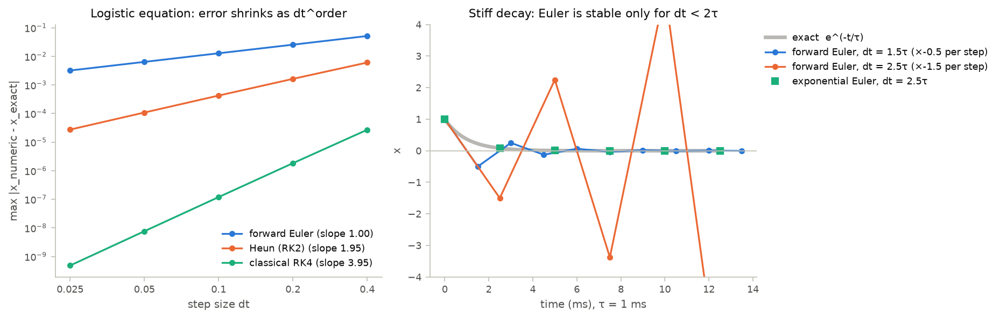

# 01 · BrainPy basics: integrators and JIT

Course day 1. Code: [`neuromodels/basics.py`](../neuromodels/basics.py),
[`scripts/01_brainpy_basics.py`](../scripts/01_brainpy_basics.py),
[`tests/test_basics.py`](../tests/test_basics.py).

Every model in this repo is an ODE system $\dot x = f(x, t)$ handed to
`bp.odeint`, so the integrator decides how close a simulated spike train sits
to the true one. This chapter measures that directly.

## Model

One step of size $\Delta t$ for each method used here:

| method (`bp.odeint(method=...)`) | update | global error |
|---|---|---|
| forward Euler (`euler`) | $x_{n+1} = x_n + \Delta t\, f(x_n)$ | $O(\Delta t)$ |
| Heun (`heun2`) | average of the slope at $x_n$ and at the Euler prediction | $O(\Delta t^2)$ |
| classical Runge–Kutta (`rk4`) | weighted average of four slopes | $O(\Delta t^4)$ |
| exponential Euler (`exp_euler`, `exp_auto`) | $x_{n+1} = x_n + \frac{e^{A\Delta t}-1}{A} f(x_n)$, $A = \partial f / \partial x$ | exact when $f$ is linear |

Two test problems with exact solutions:

$$\dot x = x(1-x), \qquad x(t) = \frac{1}{1 + (1/x_0 - 1)\,e^{-t}}$$

$$\dot x = -x/\tau, \qquad x(t) = e^{-t/\tau}$$

For the decay, forward Euler multiplies $x$ by $(1 - \Delta t/\tau)$ every
step, so it decays only while $|1 - \Delta t/\tau| < 1$, that is $\Delta t < 2\tau$.

## What the code does

- `logistic_error` and `convergence_order` integrate the logistic equation at
  $\Delta t = 0.4 \dots 0.025$ and fit the slope of log(error) against log($\Delta t$).
- `decay_trajectory` steps the fast decay at $\Delta t = 1.5\tau$ and $2.5\tau$.
- The script also runs the same 1000-neuron LIF population with and without
  JIT compilation.

| result | value |
|---|---|
| fitted orders: Euler / Heun / RK4 | 1.00 / 1.95 / 3.95 |
| Euler at $\Delta t = 2.5\tau$ | grows ×1.5 per step with alternating sign |
| exponential Euler at $\Delta t = 2.5\tau$ | matches $e^{-t/\tau}$ to $10^{-12}$ |
| 1000 LIF neurons, compiled vs interpreted | 0.06 ms vs 78 ms per step (≈1270×, 4-core CPU) |

### BrainPy 2.8 details that change results

- **Time stamps.** `bp.DSRunner` labels sample *i* with the step's start time
  $t_i$ but stores the state at $t_i + \Delta t$; `bp.IntegratorRunner` labels it
  with the end time. `neuromodels.utils.run` returns end-of-step times, so traces
  line up with the true trajectory (checked against the exact LIF solution to $10^{-10}$).
- **Precision.** BrainPy computes in float32 unless `bm.enable_x64()` is called.
  The tests run in float64 so they can compare against closed forms.
- **API drift.** Older BrainPy code receives time through `update(self, tdi)`;
  version 2.8 reads it with `bp.share.load('t')` and `bp.share.load('dt')`.
  `bp.NeuGroup` survives as an alias of `bp.dyn.NeuDyn`. The pinned versions in
  `requirements.txt` keep results reproducible.

## What the tests verify

- Each method's fitted order lies within ±0.15 of 1, 2, and 4.
- Forward Euler decays at $\Delta t = 1.5\tau$ and blows up at $2.5\tau$;
  exponential Euler stays exact at $2.5\tau$.
- `IntegratorRunner` reports end-of-step times; `utils.run` corrects `DSRunner`'s.

## Questions to think about

1. The HH sodium gate has $\tau_m \approx 0.1$–$0.5$ ms. What step size would
   forward Euler need, and why can `exp_auto` take larger steps on the same model?
2. Exponential Euler is exact for linear equations. Why does it drop to first
   order on the logistic equation?
3. A threshold-and-reset rule turns a smooth ODE into a hybrid system. Why does
   RK4 still give spike times that are only accurate to $O(\Delta t)$, and what
   would fix that?
4. Compiling made the LIF population ~1270× faster. What does JIT tracing assume
   about Python control flow, and what goes wrong if `update()` contains
   `if V > V_th:` instead of `bm.where`?
