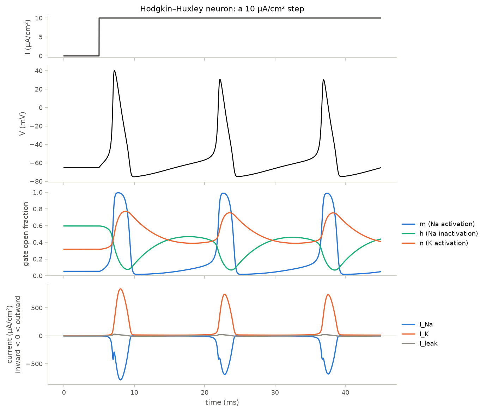
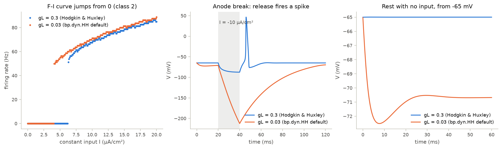

# 02 · The Hodgkin–Huxley model

Course day 2. Code: [`neuromodels/neurons.py`](../neuromodels/neurons.py) (`HH`),
[`neuromodels/analysis.py`](../neuromodels/analysis.py) (`hh_rest_state`, `hh_jacobian`),
[`scripts/02_hodgkin_huxley.py`](../scripts/02_hodgkin_huxley.py),
[`tests/test_hodgkin_huxley.py`](../tests/test_hodgkin_huxley.py).

## Model

$$C\frac{dV}{dt} = -\bar g_{Na} m^3 h (V - E_{Na}) - \bar g_K n^4 (V - E_K) - g_L (V - E_L) + I$$

$$\frac{dx}{dt} = \alpha_x(V)(1 - x) - \beta_x(V)\,x, \qquad x \in \{m, h, n\}$$

| gate | opening rate $\alpha_x$ (1/ms) | closing rate $\beta_x$ (1/ms) |
|---|---|---|
| $m$ | $\dfrac{0.1(V+40)}{1 - e^{-(V+40)/10}}$ | $4\,e^{-(V+65)/18}$ |
| $h$ | $0.07\,e^{-(V+65)/20}$ | $\dfrac{1}{1 + e^{-(V+35)/10}}$ |
| $n$ | $\dfrac{0.01(V+55)}{1 - e^{-(V+55)/10}}$ | $0.125\,e^{-(V+65)/80}$ |

| parameter | value | unit |
|---|---|---|
| $C$ | 1 | µF/cm² |
| $\bar g_{Na}$, $\bar g_K$, $g_L$ | 120, 36, 0.3 | mS/cm² |
| $E_{Na}$, $E_K$, $E_L$ | 50, −77, −54.387 | mV |

Values from Hodgkin & Huxley (1952), shifted so rest sits at −65 mV. The
$\alpha_m$ and $\alpha_n$ expressions are 0/0 at −40 and −55 mV; the code writes
them with `exprel(x) = (e^x − 1)/x`, which is finite there.

## What the code does

- `HH` subclasses `bp.dyn.NeuDyn`, integrates $(V, m, h, n)$ with one
  `bp.JointEq`, and starts every gate at its steady state.
- The script draws a spike's anatomy (fast Na influx, peak $I_{Na} ≈ −790$
  µA/cm², then K efflux, peak $I_K ≈ 840$), the gate kinetics, and three
  excitability experiments.
- `hh_rest_state` solves for rest under constant input; `hh_jacobian` gives the
  linearization used to find where rest loses stability.

## Findings

| experiment | result |
|---|---|
| firing onset, step from rest | 6.3 µA/cm², straight to ≈51 Hz (class 2) |
| rest loses linear stability | 9.78 µA/cm² (Hopf) |
| between 6.3 and 9.78 µA/cm² | rest and repetitive firing coexist; a 1 ms kick switches the cell on |
| −10 µA/cm² for 20 ms, then release | one rebound spike (anode break) |

**BrainPy's default leak is ten times too small.** `bp.dyn.HH` in BrainPy 2.8.2
defaults to $g_L = 0.03$ mS/cm². With $E_L = −54.387$ mV that moves rest to
−70.68 mV, lowers the firing onset to 4.1 µA/cm², and removes anode-break
excitation; the same −10 µA/cm² pulse drives V to −210 mV. `HH` here uses 0.3.
Pass `gL=0.3` to the built-in, and check which value any BrainPy-based HH code
uses before comparing its numbers with the literature.

## What the tests verify

- `HH` matches `bp.dyn.HH(gL=0.3)` to $10^{-9}$ mV over 100 ms.
- Rest is −65.00 ± 0.01 mV; the built-in default rests at −70.68 mV.
- Firing starts at 6.3 ± 0.15 µA/cm² at more than 40 Hz.
- The leading eigenvalue at rest crosses zero between 9.75 and 9.80 µA/cm².
- At 8 µA/cm² a cell placed at rest stays silent; a 1 ms kick makes it fire.
- Releasing a hyperpolarizing pulse fires exactly one spike.

## Questions to think about

1. The Hopf point (9.78) sits above the firing onset (6.3). Where does the
   stable firing cycle come from below the Hopf point, and what kind of
   bifurcation creates it?
2. A spike needs $m$ to be much faster than $h$ and $n$. Predict what happens
   if $\tau_h$ were as short as $\tau_m$, then test it.
3. Hodgkin and Huxley measured at 6.3 °C. With $Q_{10} = 3$, how much faster
   are the gates at 37 °C, and what happens to spike width and the F-I curve?
4. Bistability means history matters. Which brief input would stop repetitive
   firing at 8 µA/cm², and why must its timing matter?
