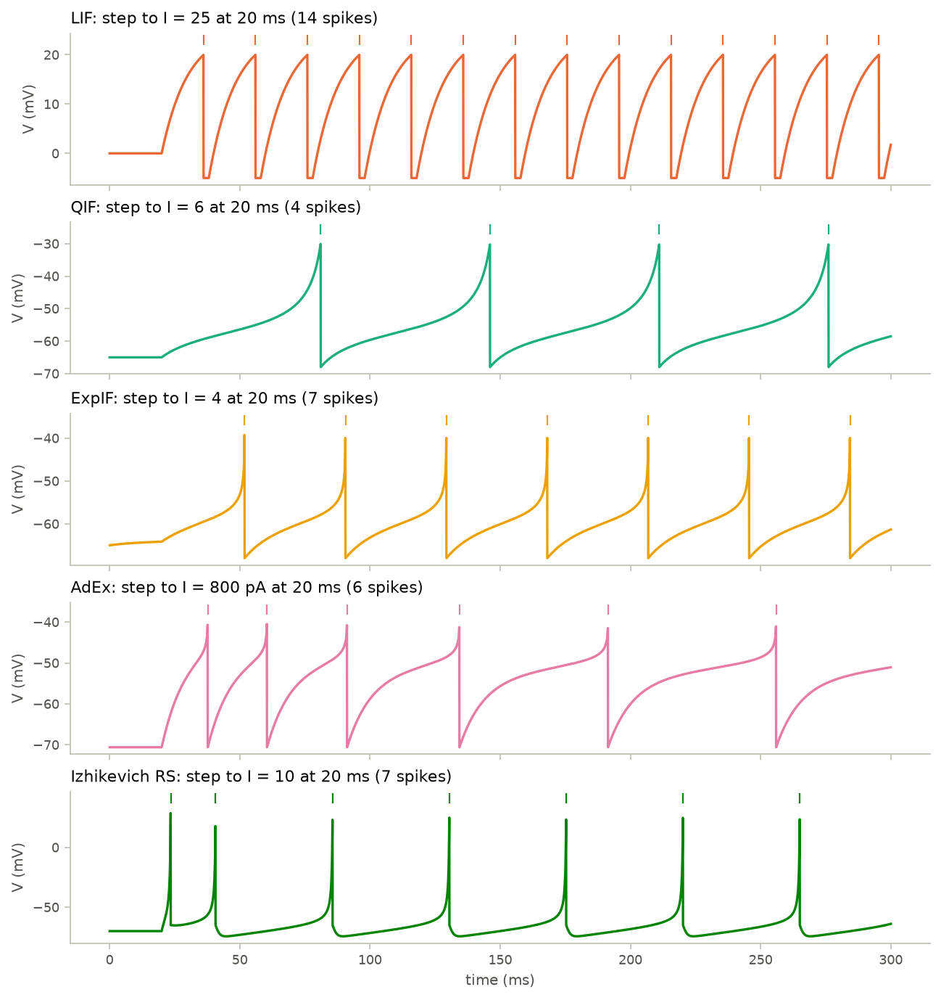
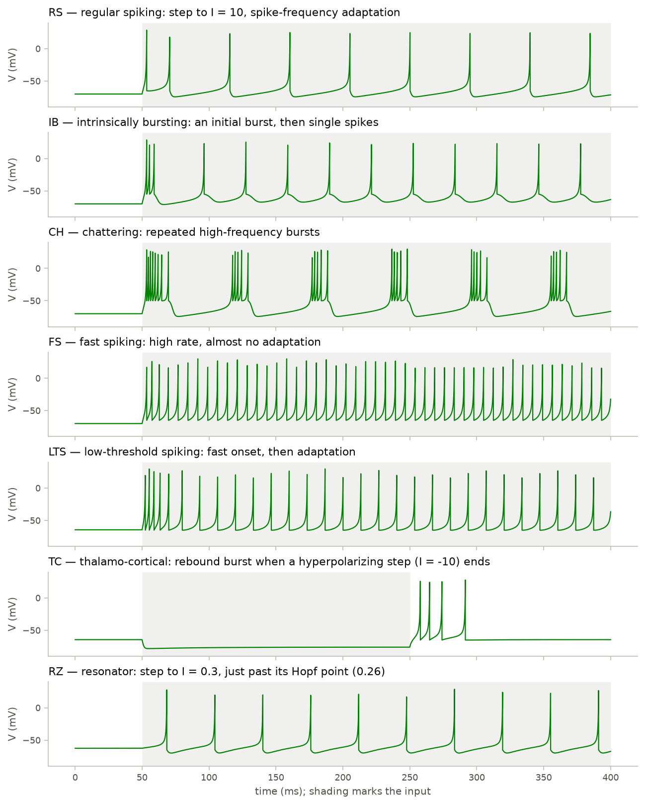

# 03 · Reduced neuron models

Course day 3, first half. Code: [`neuromodels/neurons.py`](../neuromodels/neurons.py),
[`neuromodels/analysis.py`](../neuromodels/analysis.py),
[`scripts/03_reduced_models.py`](../scripts/03_reduced_models.py),
[`tests/test_neurons.py`](../tests/test_neurons.py).

HH needs four variables and a step of ~0.01 ms. Reduced models keep one or
two variables and replace the spike itself with a threshold-and-reset rule.
What each one keeps, and what it drops, decides which questions it can answer.

## Models

| model | equations | reset when V reaches the cutoff |
|---|---|---|
| LIF | $\tau\dot V = -(V - V_{rest}) + RI$ | $V \to V_{reset}$, hold for $t_{ref}$ |
| QIF | $\tau\dot V = c(V - V_{rest})(V - V_c) + RI$ | $V \to V_{reset}$ |
| ExpIF | $\tau\dot V = -(V - V_{rest}) + \Delta_T e^{(V - V_T)/\Delta_T} + RI$ | $V \to V_{reset}$ |
| AdEx | $C\dot V = -g_L(V - E_L) + g_L\Delta_T e^{(V - V_T)/\Delta_T} - w + I$, $\ \tau_w\dot w = a(V - E_L) - w$ | $V \to V_r$, $w \to w + b$ |
| Izhikevich | $\dot V = 0.04V^2 + 5V + 140 - u + I$, $\ \dot u = a(bV - u)$ | $V \to c$, $u \to u + d$ |

| model | defaults (mV, ms) | rheobase (closed form) | source |
|---|---|---|---|
| LIF | $V_{rest}=0$, $V_{reset}=-5$, $V_{th}=20$, $\tau=10$, $R=1$ | $(V_{th} - V_{rest})/R = 20$ | Lapicque (1907) |
| QIF | $V_{rest}=-65$, $V_c=-50$, $c=0.07$, $\tau=10$, cutoff −30 | $c(V_c - V_{rest})^2/4R = 3.94$ | Latham et al. (2000) |
| ExpIF | $V_{rest}=-65$, $V_T=-59.9$, $\Delta_T=3.48$, $\tau=10$, cutoff −30 | $(V_T - V_{rest} - \Delta_T)/R = 1.62$ | Fourcaud-Trocmé et al. (2003) |
| AdEx | $C=281$ pF, $g_L=30$ nS, $E_L=-70.6$, $V_T=-50.4$, $\Delta_T=2$, $a=4$ nS, $\tau_w=144$, $b=80.5$ pA, cutoff −40.4 | 627.2 pA (Hopf, see 04) | Brette & Gerstner (2005) |
| Izhikevich RS | $a=0.02$, $b=0.2$, $c=-65$, $d=8$ | 3.7975 (Hopf, see 04) | Izhikevich (2003) |

LIF and QIF defaults match BrainPy's built-ins; ExpIF matches except for the
spike cutoff (see Findings). The LIF firing rate has
a closed form: with $V_\infty = V_{rest} + RI > V_{th}$,

$$f = \left[t_{ref} + \tau \ln\frac{V_\infty - V_{reset}}{V_\infty - V_{th}}\right]^{-1}.$$

## What the code does

- One `bp.dyn.NeuDyn` subclass per model, each starting at rest. BrainPy's
  built-in integrate-and-fire models start at 0 mV instead (`ZeroInit`), which
  is above threshold for the biological parameter sets.
- AdEx is written in physical units; dividing by $g_L$ gives BrainPy's
  `bp.dyn.AdExIF` form with $\tau = C/g_L$ and $R = 1/g_L$, and the test confirms
  the two agree to $10^{-14}$ mV.
- `fi_curve` simulates one neuron per input value in a single vectorized run.

## Findings

- **Class 1 vs class 2.** HH jumps to ≈51 Hz at onset; LIF, QIF, and ExpIF start
  from zero. The approach to zero differs: at 1.025 × rheobase LIF already fires
  24 Hz (its period grows only logarithmically), QIF 2.8 Hz and ExpIF 2.4 Hz
  (period $\propto (I - I_{rh})^{-1/2}$ near a saddle-node).
- **Seven cell types from four parameters.** The Izhikevich presets reproduce
  the patterns of Izhikevich (2003), Fig. 2: RS adapts (first ISI 17 ms, then
  45 ms), IB bursts then fires singly, CH repeats bursts, FS fires ≈135 Hz
  without adapting, TC fires a rebound burst, and RZ fires only past its Hopf point.
- **A cutoff is not a threshold.** BrainPy 2.8.2's `bp.dyn.ExpIF` and `AdExIF`
  default to a −55 mV cutoff (their docstrings say −30), only 1.4 $\Delta_T$ above
  $V_T$, which clips the exponential upswing. The classes here use −30 mV
  (ExpIF) and $V_T + 5\Delta_T$ (AdEx).

## What the tests verify

- Every class matches its BrainPy built-in to $10^{-9}$ mV, and `Izhikevich`
  reproduces `izhikevich_demo.py` spike for spike.
- LIF inter-spike intervals fall in $[T, T + \Delta t)$ of the closed-form period.
- QIF and ExpIF are silent at 0.98 × rheobase and fire below 5 Hz at 1.02 ×.
- The preset firing patterns (adaptation, bursting, rebound, resonance) hold
  as quantitative ISI criteria.

## Questions to think about

1. LIF, QIF, and ExpIF differ only in the spike-generating term. Which one's
   F-I curve near rheobase would you expect to match a cortical pyramidal cell,
   and which recording would settle it?
2. AdEx has subthreshold adaptation ($a$) and spike-triggered adaptation ($b$).
   Which one produces the adaptation in the traces, and which one decides the
   bifurcation type in chapter 04?
3. The Izhikevich spike peak (30 mV) is a convention, not a measurement. Which
   quantities from this model can you trust, and which not?
4. IB and CH differ only in $c$ and $d$. Use the reset point $(c, u + d)$ on the
   phase plane to explain why a higher $c$ produces repeated bursts.
