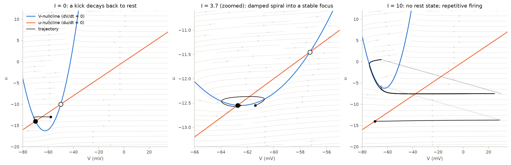
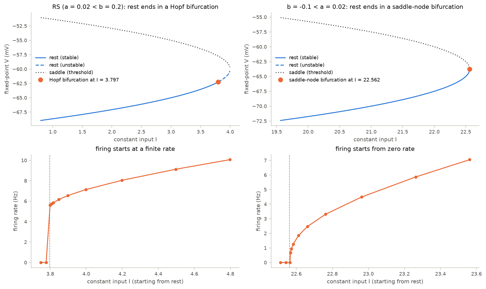

# 04 · Dynamics analysis: phase planes and bifurcations

Course day 3, second half. Code: [`neuromodels/analysis.py`](../neuromodels/analysis.py),
[`scripts/04_dynamics_analysis.py`](../scripts/04_dynamics_analysis.py),
[`tests/test_dynamics_analysis.py`](../tests/test_dynamics_analysis.py).

Chapter 03 showed *that* some neurons start firing at a finite rate and others
from zero. A two-variable model makes the reason visible: how the resting
state disappears as input grows.

## Model

Write the Izhikevich model as $\dot V = f(V) - u + I$, $\dot u = a(bV - u)$ with
$f(V) = 0.04V^2 + 5V + 140$.

- Nullclines: $u = f(V) + I$ (where $\dot V = 0$) and $u = bV$ (where $\dot u = 0$).
- Fixed points: $0.04V^2 + (5 - b)V + 140 + I = 0$.
- Jacobian: $J = \begin{pmatrix} f'(V) & -1 \\ ab & -a \end{pmatrix}$, so
  $\operatorname{tr} J = f'(V) - a$ and $\det J = a\,(b - f'(V))$.

Raising $I$ raises the resting $V$, and with it $f'(V) = 0.08V + 5$. Whichever
condition is met first ends the resting state:

| case | condition met first | bifurcation | critical input |
|---|---|---|---|
| $b < a$ | $\det J = 0$ at $f'(V) = b$ | saddle-node | $I_{SN} = (5 - b)^2/0.16 - 140$ |
| $b > a$ | $\operatorname{tr} J = 0$ at $f'(V) = a$, with $\det J > 0$ | Andronov–Hopf | $I_H = -f(V_H) + bV_H$, $V_H = (a - 5)/0.08$ |

| parameters | bifurcation | critical input |
|---|---|---|
| RS ($a = 0.02$, $b = 0.2$) | Hopf | 3.7975 |
| FS ($a = 0.1$, $b = 0.2$) | Hopf | 3.9375 |
| LTS, TC ($a = 0.02$, $b = 0.25$) | Hopf | 0.685 |
| RZ ($a = 0.1$, $b = 0.26$) | Hopf | 0.2625 |
| $a = 0.02$, $b = -0.1$ | saddle-node | 22.5625 |

The same argument applies to AdEx (Touboul & Brette 2008): saddle-node where
$F'(V) = a$, Hopf where $F'(V) = C/\tau_w$, so Hopf exactly when $a > C/\tau_w$.
The Brette & Gerstner fit has $a = 4$ nS $> C/\tau_w = 1.95$ nS: Hopf, at 627.2 pA.

## What the code does

- `izhikevich_rest_loss` and `adex_rest_loss` return the bifurcation type, the
  critical input, and the voltage there; `izhikevich_fixed_points` and
  `izhikevich_jacobian` give the rest of the picture.
- The script draws phase planes (nullclines, flow, fixed points, trajectories)
  and bifurcation diagrams with the onset of firing measured from rest.
- It also runs BrainPy's `bp.analysis.PhasePlane2D`, the course's tool, and
  prints its fixed points next to the closed form.

## Findings

- **Bifurcation type predicts the F-I curve.** Just past $I_H$ the RS neuron
  fires at 5.6 Hz; just past $I_{SN}$ the $b = -0.1$ neuron fires at 0.7 Hz and
  its rate keeps falling toward zero. Near a saddle-node the trajectory crawls
  past the "ghost" of the vanished fixed points; past a Hopf point it joins an
  oscillation whose period stays finite.
- **Both "regular spiking" fits are Hopf-type** (Izhikevich RS and AdEx RS),
  although RS cells are often called class 1. Their slow recovery variable keeps
  the onset rate low (5.6 Hz), so the jump is easy to miss in data.
- **The RS Hopf is subcritical.** Just below $I_H$, a neuron kicked from a
  lower-input rest fires while one placed at its own rest stays silent: rest and
  firing coexist, as in HH (chapter 02).
- **Numerical tools have resolution.** `PhasePlane2D` finds the fixed points
  only to its grid: its saddle sits at $u = -11.45$ exactly, 0.005 mV from the
  true root. `Bifurcation2D` took ~2 minutes by brute force here; the closed
  forms are instant and exact.

## What the tests verify

- RS loses rest through a Hopf point at 3.7975, where $J$ has purely imaginary
  eigenvalues; $b = -0.1$ loses it through a saddle-node at 22.5625, with two
  fixed points just below and none just above.
- Simulations started at rest stay silent 0.03 below $I_H$ and fire 0.03 above.
- The onset rate is below 1.5 Hz after the saddle-node and above 4 Hz after the Hopf.
- `PhasePlane2D` agrees with the closed-form fixed points to its grid accuracy.
- AdEx (Brette & Gerstner) is silent 5 pA below its computed rheobase and fires 5 pA above.

## Questions to think about

1. A 5.6 Hz onset is a "jump" in theory but looks continuous in noisy data. What
   experiment separates a Hopf neuron from a saddle-node neuron more cleanly
   than an F-I curve? (Think about subthreshold oscillations and resonance.)
2. Why does a trajectory slow down near the ghost of a saddle-node, and how
   does the passage time scale with $I - I_{SN}$?
3. With bistability below $I_H$, a brief inhibitory pulse at the right phase can
   switch firing off. Where on the phase plane must the pulse push the state?
4. RS and FS share $b = 0.2$ but lose rest at 3.80 and 3.94. Which term of the
   Jacobian explains the difference, and why does a faster recovery variable
   (larger $a$) push the Hopf point to higher input?
