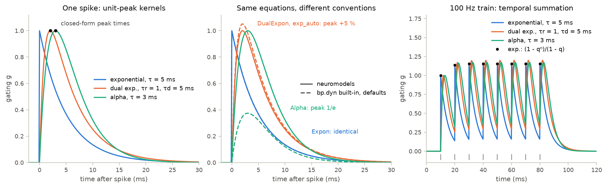
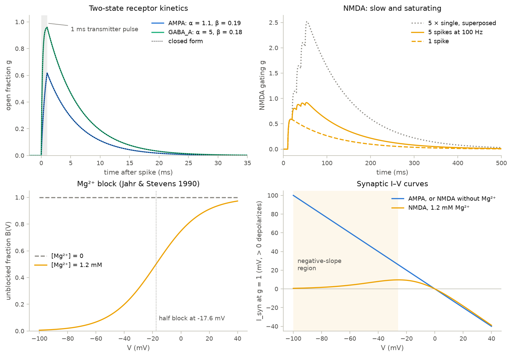
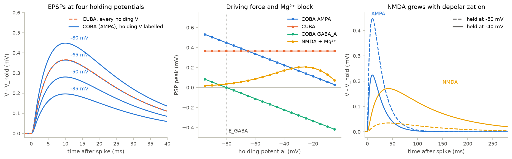

# 05 · Synapse models

Course day 4, first half. Code: [`neuromodels/synapses.py`](../neuromodels/synapses.py),
[`scripts/05_synapses.py`](../scripts/05_synapses.py),
[`tests/test_synapses.py`](../tests/test_synapses.py).

A chemical synapse turns a presynaptic spike into a brief conductance change in
the postsynaptic membrane. Two separate choices decide what the neuron sees:
the time course of the conductance (the kinetics), and whether the resulting
current depends on the membrane potential (the output).

## Model

Gating kinetics for spikes at times $t_k$ (each linear kernel scaled to a peak of 1):

$$\text{exponential:}\ \ \dot g = -\frac{g}{\tau} + \sum_k \delta(t - t_k) \qquad
\text{alpha:}\ \ g(t) = \frac{t}{\tau}\,e^{1 - t/\tau}$$

$$\text{dual exponential:}\ \ g(t) = A\left(e^{-t/\tau_d} - e^{-t/\tau_r}\right), \qquad
t_{peak} = \frac{\tau_r \tau_d}{\tau_d - \tau_r}\ln\frac{\tau_d}{\tau_r}$$

$$\text{two-state receptor:}\ \ \dot g = \alpha [T](1 - g) - \beta g, \qquad [T] = T_{max}\ \text{for}\ T_{dur}\ \text{after each spike}$$

$$\text{NMDA:}\ \ \dot g = -\frac{g}{\tau_d} + a\,x\,(1 - g), \qquad \dot x = -\frac{x}{\tau_r} + \sum_k \delta(t - t_k)$$

Output onto a LIF neuron, $\tau_m \dot V = -(V - V_{rest}) + I_{syn} + I_{ext}$ with $R = 1$ (positive current depolarizes):

$$I_{CUBA} = J g, \qquad I_{COBA} = \bar g\, g\,(E - V), \qquad
I_{NMDA} = \bar g\, g\, B(V)\,(E - V), \qquad B(V) = \Big[1 + \tfrac{[\mathrm{Mg^{2+}}]}{3.57}\,e^{-0.062 V}\Big]^{-1}$$

| parameter | value | unit | source |
|---|---|---|---|
| AMPA $\alpha$, $\beta$ | 1.1, 0.19 | mM⁻¹ms⁻¹, ms⁻¹ | Destexhe, Mainen & Sejnowski (1998) |
| GABA_A $\alpha$, $\beta$ | 5, 0.18 | mM⁻¹ms⁻¹, ms⁻¹ | same |
| transmitter pulse $T_{max}$, $T_{dur}$ | 1, 1 | mM, ms | same |
| $E_{AMPA}$, $E_{NMDA}$, $E_{GABA_A}$ | 0, 0, −80 | mV | same |
| NMDA $\tau_r$, $\tau_d$, $a$ | 2, 100, 0.5 | ms, ms, ms⁻¹ | Wang (2002) |
| Mg²⁺ block constants | 3.57, 0.062 | mM, mV⁻¹ | Jahr & Stevens (1990) |
| $[\mathrm{Mg^{2+}}]_o$ | 1.2 | mM | typical value (Wang 2002 used 1.0) |
| LIF $\tau_m$, $V_{rest}$, $V_{th}$ | 20, −65, −50 | ms, mV, mV | illustrative |

$\bar g$ is in units of the leak conductance and $J$ in mV; $J = \bar g\,(E - V_{rest})$ makes the outputs agree at rest.

## What the code does

- Each kinetic model is a `bp.dyn.SynDyn` with `bm.Variable` state and
  `bp.odeint`. A spike is added *after* the step's integration, so a spike given
  at step $k$ acts at $t_{k+1}$, the time `run()` stamps on sample $k$;
  `spike_input` places a spike at time $t$ in the step that ends at $t$.
- The single linear decays (exponential, two-state receptor) use exponential
  Euler, which is exact for them. The coupled pairs (dual exponential, alpha,
  NMDA) use `rk4`, because exponential Euler holds the rise variable fixed
  during a step.
- `SynapticLIF` gives each synapse its own LIF neuron. The membrane integrates
  with the conductance from the start of the step, and the V-dependent current
  sits inside the derivative. `I_ext` holds each neuron at its own baseline.

## Findings

| quantity | result |
|---|---|
| dual exponential ($\tau_r = 1$, $\tau_d = 5$ ms) | peak 1.0000 at 2.01 ms (formula 2.012 ms) |
| 100 Hz train, $\tau = 5$ ms exponential | peaks $1 + q + \dots + q^{n-1}$, $q = e^{-2}$, → 1.1565 |
| AMPA / GABA_A open fraction after one spike | 0.618 / 0.960; decay $1/\beta$ = 5.26 / 5.56 ms |
| NMDA gating: 1 spike / 5 spikes at 100 Hz | 0.592 / 0.919 (a linear sum would reach 2.52) |
| Mg²⁺ block at 1.2 mM | $B(-65) = 0.050$, $B(0) = 0.748$, half block at −17.6 mV |
| NMDA current at $g = 1$ | largest at −26 mV; grows with depolarization below that |
| COBA EPSP at −80 / −65 / −50 / −35 mV | 0.448 / 0.364 / 0.280 / 0.196 mV, exactly ∝ $E - V$ |
| CUBA EPSP | 0.366 mV at every holding potential |

**Why COBA scales exactly.** With $u = V - E$ the COBA membrane equation reads
$\tau_m \dot u = -(u - u_0) - \bar g\, g(t)\, u$, which is linear and homogeneous
in $(u, u_0)$. The whole PSP therefore scales with $u_0 = V_{hold} - E$,
including the shunting that shortens the time constant.

**BrainPy 2.8.2 conventions.** `bp.dyn.Expon` and `bp.dyn.NMDA` (with
`method="rk4"`) match the classes here to $10^{-12}$. `bp.dyn.DualExpon` uses the
same peak normalization, but its default `exp_auto` overshoots the peak by 5 %
at $\Delta t = 0.1$ ms, $\tau_r = 1$ ms. `bp.dyn.Alpha` peaks at $1/e$, not 1.
`bp.dyn.AMPA`/`GABAa` start the transmitter pulse in the step that receives the
spike and time it by comparing floats, so a 0.3 ms pulse at $\Delta t = 0.1$ ms
lasts three or four steps depending on the spike time. In a `ProjAlignPostMg2`
network the post neuron decays `Expon.g` once before using it, which makes the
CUBA EPSP exactly $e^{-\Delta t/\tau_s}$ (2 %) smaller than here; the exact EPSP
lies between the two (this code 1 % high, BrainPy 1 % low).

## What the tests verify

- The exponential and two-state traces equal their closed forms to $10^{-12}$
  and decay with $\tau$ and $1/\beta$. Dual-exponential and alpha peaks fall at
  the closed-form times within $10^{-3}$ ms, with height $1 \pm 10^{-6}$.
- Linear kernels superpose exactly under a 100 Hz train; NMDA summation is
  sublinear.
- $B(V)$ follows Jahr & Stevens and rises monotonically; from −90 to −30 mV the
  NMDA current grows with V while the Mg-free and AMPA currents shrink.
- CUBA EPSPs are identical at all holding potentials; COBA EPSPs are
  proportional to $E - V_{hold}$ to $10^{-9}$. GABA_A PSPs reverse at −80 mV. NMDA
  EPSPs grow with depolarization while AMPA EPSPs shrink.
- The CUBA EPSP converges to its closed form at first order in $\Delta t$.
- Kinetics, outputs and a full BrainPy projection agree with the built-ins
  once the documented conventions are applied.

## Questions to think about

1. The COBA EPSP stays exactly proportional to the driving force despite
   shunting. Which of these breaks that: a tonic conductance with another
   reversal potential, a second synapse active at the same time, or a
   voltage-dependent conductance? Why?
2. In immature neurons $E_{GABA_A}$ sits near −40 mV. What does a GABA_A input
   do to a cell at −65 mV, and to one held just below a −50 mV threshold?
3. NMDA gating saturates and decays over 100 ms. Why does saturation make the
   NMDA drive of a network less sensitive to its firing rate than a linear slow
   synapse, and why does that help persistent activity (chapter on networks)?
4. The kernels here share a unit peak. Normalized to unit area (charge)
   instead, which kernel would summate most under a 100 Hz train, and which
   normalization makes a fair comparison between synapse types?
