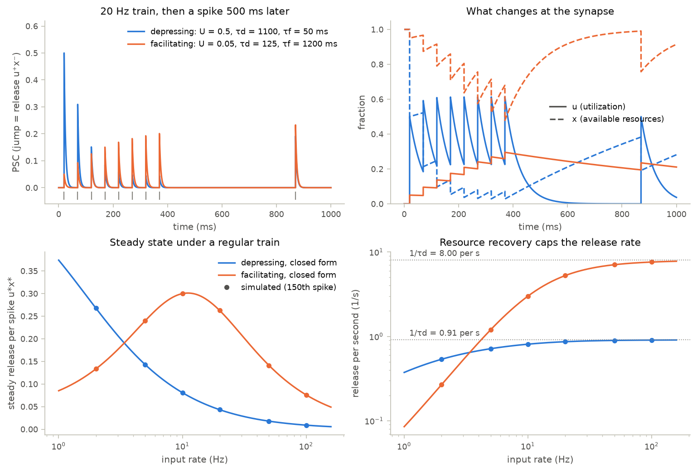
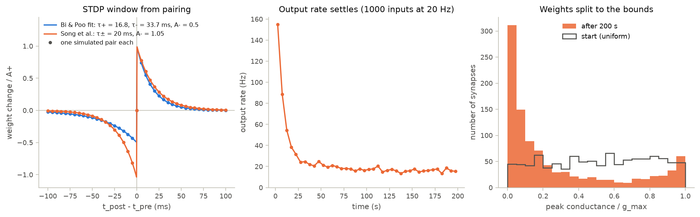
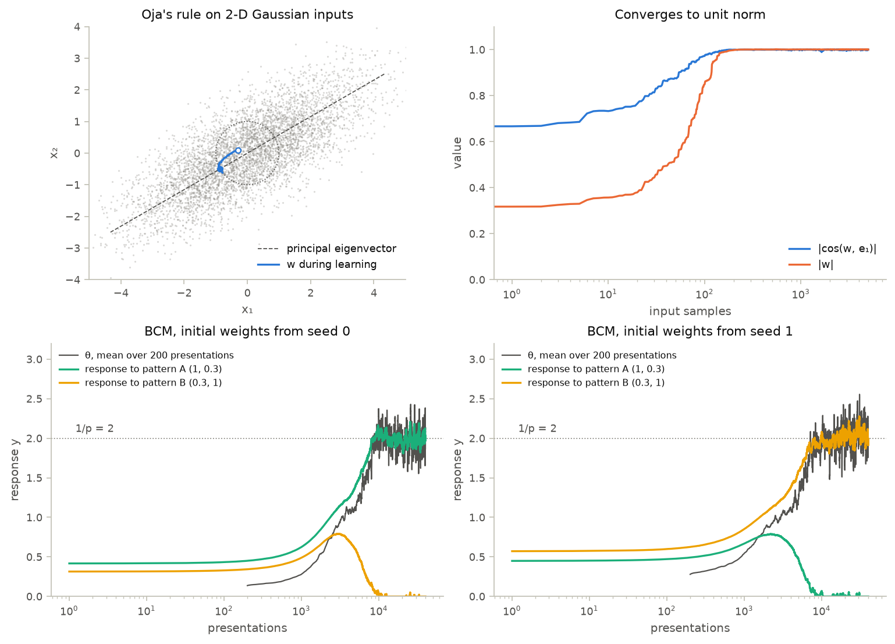

# 06 · Synaptic plasticity

Course day 4, second half. Code: [`neuromodels/plasticity.py`](../neuromodels/plasticity.py),
[`scripts/06_plasticity.py`](../scripts/06_plasticity.py),
[`tests/test_plasticity.py`](../tests/test_plasticity.py).

Synaptic strength changes on two time scales. Short-term plasticity reshapes each spike
train within hundreds of milliseconds and then recovers. Long-term rules (STDP, Oja, BCM)
change the weights themselves, driven by pre- and postsynaptic correlations.

## Model

**Short-term plasticity** (Tsodyks, Pawelzik & Markram 1998). Each spike releases $r = u^+ x^-$:

$$\dot u = -\frac{u}{\tau_f} + U(1 - u^-)\sum_k \delta(t - t_k), \qquad
\dot x = \frac{1 - x}{\tau_d} - u^+ x^- \sum_k \delta(t - t_k)$$

For a regular train with interval $T$ the release settles at $r^* = u^* x^*$, where

$$u^* = \frac{U}{1 - (1 - U)e^{-T/\tau_f}}, \qquad x^* = \frac{1 - e^{-T/\tau_d}}{1 - (1 - u^*)e^{-T/\tau_d}}.$$

**Pair-based STDP** with traces $x_{pre}$ (decay $\tau_+$) and $y_{post}$ (decay $\tau_-$), each $+1$ per spike:

$$\dot w = A_+ x_{pre} \sum \delta(t - t_{post}) - A_- y_{post} \sum \delta(t - t_{pre}), \qquad
\Delta w(\Delta t) = \begin{cases} A_+ e^{-\Delta t/\tau_+} & \Delta t = t_{post} - t_{pre} > 0 \\ -A_- e^{\Delta t/\tau_-} & \Delta t < 0 \end{cases}$$

Independent Poisson trains drift at $\langle \dot w \rangle = r_{pre} r_{post}(A_+\tau_+ - A_-\tau_-)$.

**Oja and BCM**, for a rate neuron with input vector $x$:

$$\text{Oja: } \dot w = \eta\, y\,(x - y\,w),\ y = w \cdot x \qquad
\text{BCM: } \dot w = \eta\, x\, y\,(y - \theta),\ \ \tau_\theta \dot\theta = y^2 - \theta,\ y = [w \cdot x]_+$$

Oja's only stable fixed point is the unit-norm top eigenvector of $\langle x x^T \rangle$. For patterns shown with
probability $p$, BCM's selective state needs $y = \theta = \langle y^2 \rangle = p\,y^2$: $y = 1/p$ for one pattern, 0 for the rest.

| parameter | value | source |
|---|---|---|
| depressing STP: $U$, $\tau_d$, $\tau_f$ | 0.5, 1100 ms, 50 ms | E→E means, Markram et al. (1998) via Maass et al. (2002) |
| facilitating STP: $U$, $\tau_d$, $\tau_f$ | 0.05, 125 ms, 1200 ms | E→I means, same |
| STDP $\tau_+$, $\tau_-$ | 16.8, 33.7 ms | exponential fits commonly used for Bi & Poo (1998) |
| Song et al.: $\tau_\pm$, $A_-/A_+$, $g_{max}$ | 20 ms, 1.05, 0.015 (× leak) | Song, Miller & Abbott (2000) |
| Song neuron: $\tau_m$, $V_{rest}$, $V_{th}$, $V_{reset}$ | 20 ms, −70, −54, −60 mV | after Song et al. (2000) |
| inputs: 1000 exc at 20 Hz, 200 inh at 10 Hz | $\tau_{syn}$ = 5 ms, $g_{inh}$ = 0.05, $E$ = 0 / −70 mV | after Song et al. (2000) |
| $A_+$ in the demo | 0.01 (twice 0.005) | chosen so the weights settle within 200 s |
| Oja $\eta$; BCM $\eta$, $\tau_\theta$ | 0.005; 0.002, 10 (per input) | illustrative; BCM needs $\tau_\theta \ll 1/(\eta y^2)$ |

## What the code does

- `TsodyksMarkram` (`bp.dyn.SynDyn`) integrates $u$, $x$ with exponential Euler (exact
  here) and returns the release; `STPSynapse` feeds it into an exponential conductance.
  `stp_release_sequence` and `stp_steady_state` give the exact recursion and fixed point.
- `PairSTDP` decays both traces, applies depression at pre spikes and
  potentiation at post spikes, clips $w$, and only then adds the step's spikes
  to the traces. Spikes in the same step therefore do not interact.
  `stdp_pairing` simulates one pair per $\Delta t$.
- `STDPNeuron`, a conductance-based LIF with 1000 plastic inputs, draws Poisson spikes
  from a generator it reseeds on reset; the script runs it for 200 s in four chunks.
- `OjaNeuron` and `BCMNeuron` take one input vector per step (one Euler step = the discrete rule).

## Findings

| experiment | result |
|---|---|
| 20 Hz, depressing | release falls to 0.09 $U$ by spike 8, back to 0.38 $U$ 500 ms later |
| 20 Hz, facilitating | release rises to 4.0 $U$ by spike 8 and is 4.7 $U$ 500 ms later |
| steady release, 2–100 Hz | simulation = closed form (to $5\times10^{-14}$; $6\times10^{-7}$ after 150 facilitating spikes) |
| release per second at high rates | saturates at $1/\tau_d$ = 0.91 s⁻¹ (depressing), 8 s⁻¹ (facilitating) |
| pairing, Bi & Poo taus, $A_-/A_+ = 0.5$ | $\Delta w(\pm 10\ \text{ms}) = 0.551 / -0.372$, the window to $10^{-15}$ |
| Song neuron, 200 s | output 155 Hz in the first 5 s, 15.8 Hz in the last 20 s; 46 % of weights < 0.1 $g_{max}$, 9 % > 0.9 $g_{max}$ |
| Oja, 5000 samples | $\lvert\cos(w, e_1)\rvert$ = 1.0000, $\lvert w\rvert$ = 1.0006 |
| BCM, seeds 0 and 1 | pattern A, then pattern B wins; winner 1.988 / 2.035, loser ≤ 0.001, $\theta$ ≈ 2 |

The facilitating synapse is even stronger 500 ms after the train: $x$ refills within
125 ms while $u$ decays over 1.2 s. At high rates both transmit at most about
$1/\tau_d$ releases per second, so depression signals rate *changes*, not sustained rates.

**BrainPy 2.8.2 conventions.** `bp.dyn.STP` follows the same equations but starts $u$
at $U$ instead of 0, so a train starting soon after reset sees $u^+ \approx 2U - U^2$
at its first spike (1.95 $U$ for the facilitating set). It returns $u^+x^+$ (after
release), not the release $u^+x^-$. `bp.dyn.STDP_Song2000` implements the same trace
rule as a projection (`tau_s`, `tau_t`, `A1`, `A2` ↔ $\tau_+$, $\tau_-$, $A_+$, $A_-$; defaults
16.8 ms, 33.7 ms, 0.96, 0.53) and gives the same window, except that spikes in the same
step trigger both updates there (net $A_1 - A_2$) and neither here.

## What the tests verify

- STP release equals the exact recursion to $10^{-10}$ and reaches the closed-form
  steady state. Depression and facilitation change release at least threefold
  at 20 Hz. The states match `bp.dyn.STP` once its $u$ starts at 0.
- One pre/post pair reproduces the exponential window: sign, amplitude to
  $10^{-10}$, and fitted $\tau_\pm$; it matches `bp.dyn.STDP_Song2000` to $10^{-12}$
  at every non-zero lag. Coincident spikes give 0; weights saturate at the bounds.
- Independent 20 Hz Poisson trains drift at the rate predicted for the time
  grid, within 5 % (about four standard errors). The drift is negative when
  $A_-\tau_- > A_+\tau_+$.
- `STDPNeuron` repeats every spike after a reset and keeps $0 \le w \le g_{max}$.
- Oja's rule reaches $\lvert\cos\rvert > 0.99$ with the top eigenvector of a known
  covariance and $\lvert w\rvert = 1 \pm 0.02$.
- BCM ends selective, with $y = 2 \pm 5\,\%$, the other response below 0.02 and
  $\theta \approx 2$; different seeds select different patterns.

## Questions to think about

1. A depressing synapse transmits at most $1/\tau_d$ releases per second. How
   does its postsynaptic drive respond to a step in presynaptic rate from 20 to
   40 Hz, right after the step and 2 s later?
2. Song et al. set $A_-\tau_- > A_+\tau_+$. Predict the weight histogram and
   output rate for `STDPNeuron(A_ratio=0.95)`, then run it. Which
   mechanism kept the output rate near 16 Hz in the balanced case?
3. The trace rule lets every spike interact with all earlier spikes of the
   other neuron. How would a nearest-spike rule change the Poisson drift at
   high rates, and why can no pair rule capture frequency-dependent LTP?
4. With non-zero-mean inputs, Oja's rule converges to the top eigenvector of
   $\langle x x^T \rangle$, not of the covariance. What does the neuron then
   extract, and what would you change to recover the first principal component?
