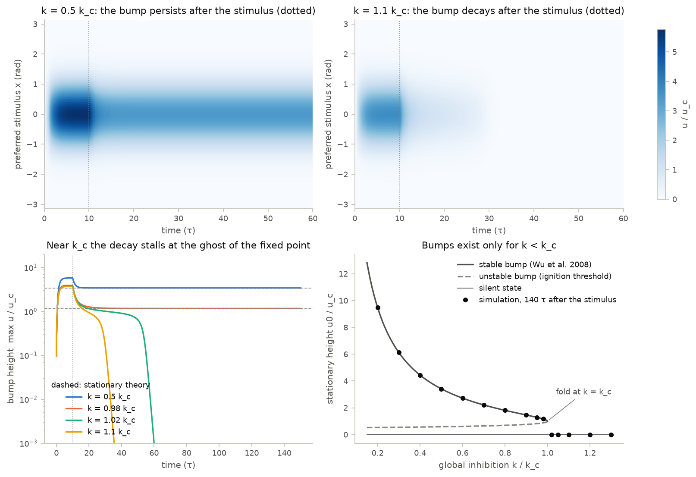
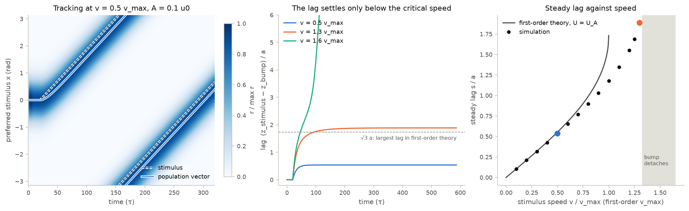
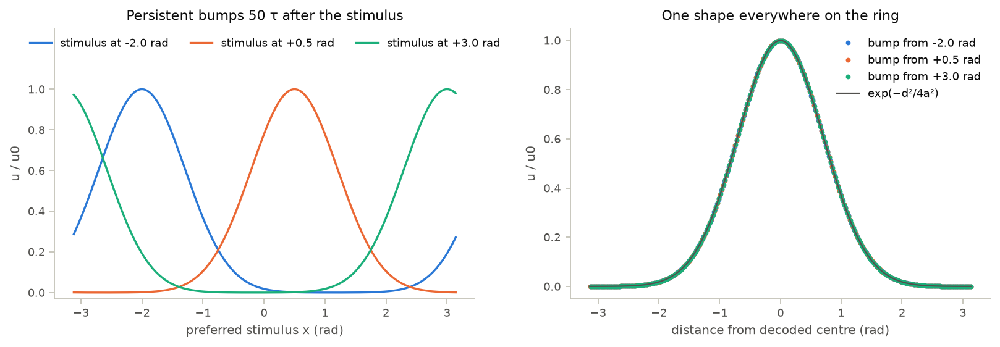

# 09 · Continuous attractor neural network

Course days 5–6. Code: [`neuromodels/networks/cann.py`](../neuromodels/networks/cann.py),
[`scripts/09_cann.py`](../scripts/09_cann.py), [`tests/test_cann.py`](../tests/test_cann.py).

A ring of neurons with translation-invariant excitation and global divisive
inhibition can hold a bump of activity at any position. The bump remembers a
stimulus after it disappears and follows it when it moves, and a population
vector reads out where it is.

## Model

$$\tau\frac{\partial u(x,t)}{\partial t} = -u + \rho\int_{-\pi}^{\pi} J(x-x')\,r(x',t)\,dx' + I_{ext}, \qquad
r = \frac{u^2}{1 + k\rho\int u^2\,dx'}, \qquad J(d) = \frac{J_0}{\sqrt{2\pi}\,a}e^{-d^2/2a^2}$$

The stimulus has the bump's own shape, $I_{ext} = A\,e^{-|x-z_0|^2/4a^2}$, and
$|x - x'|$ is the distance on the ring. For $a \ll \pi$ the stationary states
form a continuous family of Gaussians at any $z$ (Wu, Hamaguchi & Amari 2008):

$$\tilde u = u_0 e^{-(x-z)^2/4a^2},\quad u_0 = \frac{J_0\,[1+\sqrt{1-k/k_c}]}{4\sqrt\pi\,a\,k},\quad
r_0 = \frac{1+\sqrt{1-k/k_c}}{2\sqrt{2\pi}\,a\,k\rho},\quad k_c = \frac{\rho J_0^2}{8\sqrt{2\pi}\,a}$$

A Gaussian convolved with a Gaussian stays Gaussian, so the dynamics never
leave this family. With $V = U/u_c$, where $u_c = 2\sqrt2/\rho J_0$ is the
height at $k_c$, and $\kappa = k/k_c$, the height obeys an exact scalar ODE
(stimulus centred on the bump):

$$\tau\dot V = -V + \frac{2V^2}{1+\kappa V^2} + \frac{A}{u_c}, \qquad V_\pm = \frac{1 \pm \sqrt{1-\kappa}}{\kappa}\ \ (A = 0)$$

$V_+$ is the bump and $V_-$ the ignition threshold. They merge in a
saddle-node at $\kappa = 1$. Just above it, $\tau\dot V \approx -\varepsilon/2 - (V-1)^2/2$
with $\varepsilon = \kappa - 1$, so a dying bump lingers for about $2\pi\tau/\sqrt{\varepsilon}$.

**Tracking.** For a stimulus moving at speed $v$, write $s = z_0 - z$ for the
lag. The linearized dynamics around the bump are not self-adjoint, because the
gain $dr/du \propto u$ multiplies $J$. Their left zero mode is therefore
$\psi \propto u\,\partial_z u$, not the translation mode $\partial_z u$.
Projecting onto $\psi$ gives, to first order in $A$ (derived here, then checked
numerically):

$$v\tau = \frac{A}{U}\,s\,e^{-s^2/6a^2}, \qquad s_{max} = \sqrt3\,a, \qquad v_{max} = \sqrt3\,a\,e^{-1/2}\frac{A}{U\tau}$$

Position is decoded with the population vector $\hat z = \arg\sum_j r_j e^{ix_j}$ (Georgopoulos et al. 1986).

| parameter | value | unit | source |
|---|---|---|---|
| $N$ | 256 (tests 128) | neurons | chosen, $a/\Delta x \approx 20$ (10) |
| $\rho = N/2\pi$ | 40.7 | neurons/rad | model: Wu et al. (2008) |
| $\tau$ | 1 | time unit | time is measured in $\tau$ |
| $a$ | 0.5 | rad | chosen, $a \ll \pi$ |
| $J_0$ | 1 | — | chosen, sets the scale of $u$ |
| $k$ | $0.5\,k_c = 2.03$ | — | chosen, $k_c = 4.06$ for $N = 256$ |
| $A$ | $0.1\,u_0$ (tracking) | same as $u$ | chosen, weak input |
| $\Delta t$ | 0.05 | $\tau$ | RK4 |

## What the code does

- `CANN1D` subclasses `bp.DynamicalSystem`, keeps `u` and `r` in `bm.Variable`s, and
  multiplies by the circulant matrix $J(x_i - x_j)$. Since $\rho\,\Delta x = 1$ the integrals
  become sums. An FFT would cost $N\log N$ instead of $N^2$, irrelevant at $N = 256$.
- It integrates with `bp.odeint(method="rk4")`. The default `exp_auto` takes its
  linear part from `bm.vector_grad`, the column sums of the Jacobian. For an
  all-to-all coupled network these mix recurrent gain into each neuron's leak.
- `gaussian_input` builds stimuli at step midpoints (`step_midpoints`). The input is
  held constant over each step, so this avoids a $\Delta t/2$ delay for a moving stimulus.
- `stationary_bump`, `critical_inhibition`, `tracking_lag` and `max_tracking_speed`
  compute the closed forms above. With $A > 0$ the height is the largest root
  of $-bU^3 + (c + Ab)U^2 - U + A$, where $c = \rho J_0/\sqrt2$ and $b = k\rho\sqrt{2\pi}\,a$.

## Findings

| quantity | theory | simulation (N = 256, float64) |
|---|---|---|
| bump height at $k = 0.5k_c$ | 0.23701486 | 0.23701486 (relative error $7\times10^{-9}$) |
| max $u$ at 150 τ, $k = 0.98\,k_c$ | $1.165\,u_c$ | $1.165\,u_c$ |
| max $u$ at 150 τ, $k = 1.02\,k_c$ | 0 (decays after ≈ 44 τ) | $8\times10^{-43}\,u_c$ |
| population vector, off-grid stimulus | exact | error $< 10^{-15}$ rad |
| lag at $v = 0.5\,v_{max}$, $A = 0.1u_0$ | 0.276 rad ($U = U_A$) | 0.269 rad |
| fastest stimulus tracked, $A = 0.1u_0$ | $v_{max}$ | $1.3\,v_{max}$ (detaches at $1.35$) |

- The discrete ring matches the continuum theory up to the wrap-around term $e^{-\pi^2/4a^2} \approx 5\times10^{-5}$.
  Riemann sums over Gaussians are exact to rounding error even at $a/\Delta x = 10$.
- The projection matters. As $A \to 0$ at $v = 0.9\,v_{max}$, the simulated lag
  converges to the $e^{-s^2/6a^2}$ prediction (0.602 vs 0.602 rad at $A = 0.01u_0$).
  Projecting onto $\partial_z u$ instead gives $e^{-s^2/8a^2}$ and ≈ 0.55 rad.
- At $A = 0.1u_0$ the bump tracks up to $1.3\,v_{max}$ with a lag of $1.89a > \sqrt3 a$. As the lag grows,
  less input overlaps the bump and $U$ falls; a lower bump is easier to drag (an $O(A)$ effect).

## What the tests verify

- At $0.98\,k_c$ the bump persists with the height of Wu et al. ($10^{-6}$); at $1.02\,k_c$ it
  dies. The 2 % margin is limited only by the ≈ 44 τ bottleneck, and the run waits 140 τ.
- Stationary $u$ and $r$ match the Gaussians to the wrap-around term, and the
  resultant length of $r$ equals $e^{-a^2/2}$.
- A centred stimulus of $0.1$, $0.5$ or $2\,u_0$ gives the height predicted by the cubic ($10^{-7}$).
- Off-grid positions, including ones across the ±π seam, decode to within
  $10^{-9}$ rad during and after the stimulus.
- Rotating the stimulus by $m$ grid steps rotates the whole trajectory by $m$ steps ($10^{-12}$).
- A moving stimulus: the bump trails it ($s > 0$), $s(-v) = -s(v)$, and the lag settles
  below $\sqrt3a$ within 3 % of the lag equation. Near $v_{max}$ with weak input it lies
  within 2 % of the $e^{-s^2/6a^2}$ form; the $e^{-s^2/8a^2}$ form would miss by about 9 %.

## Questions to think about

1. Replace the divisive normalization by subtractive global inhibition,
   $-k\int r\,dx'$. Is the bump height still set by $k$? Does a continuum of
   positions survive, and does a sharp $k_c$ still exist?
2. Add 1 % random noise to $J$. Translational invariance breaks. Predict what a
   persistent bump does over hundreds of τ, and what this implies for
   working-memory models built on continuous attractors.
3. The lag $s \approx v\tau U/A$ grows with bump height. Why does a stronger
   memory (larger $U$) follow a moving input more sluggishly? Which parameter
   would you change to track faster without weakening persistence?
4. At $k = 1.02\,k_c$ activity survives ≈ 44 τ after the stimulus. With
   recordings of finite length, how would you tell this ghost of a fixed point
   from true persistent activity?
