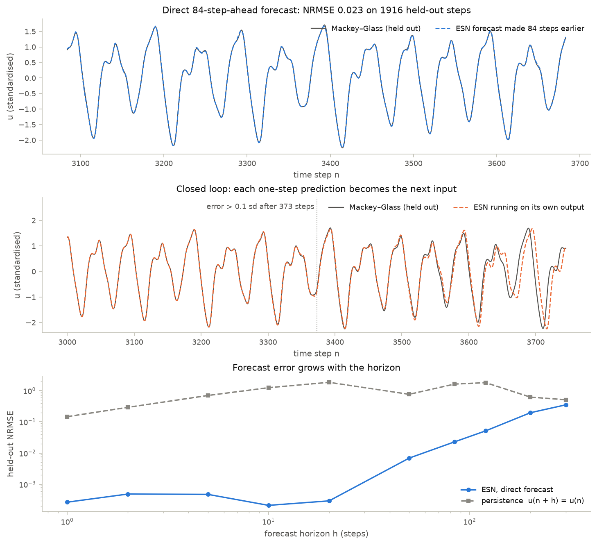
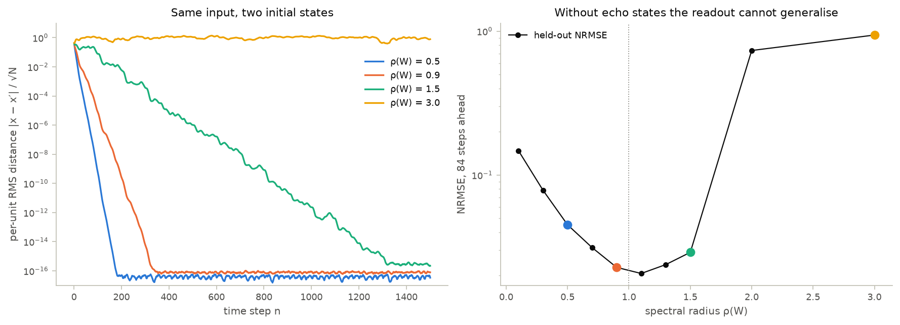

# 10 · Reservoir computing: an echo state network

Course days 5–6. Code: [`neuromodels/networks/reservoir.py`](../neuromodels/networks/reservoir.py),
[`scripts/10_reservoir.py`](../scripts/10_reservoir.py), [`tests/test_reservoir.py`](../tests/test_reservoir.py).

A fixed random recurrent network turns the history of its input into a
high-dimensional state. Only a linear readout is trained, in closed form, so
training is a single least-squares solve rather than backpropagation through time.

## Model

$$x(n) = (1-\alpha)\,x(n-1) + \alpha\tanh\big(W_{in}u(n) + Wx(n-1) + b\big), \qquad y(n) = W_{out}\,[1;\,u(n);\,x(n)]$$

Stack the feature rows $[1, u(n), x(n)]$ into $\Phi$ and the targets into $Y$.
Ridge regression (Tikhonov) then has a closed form, which is ordinary least
squares on an augmented system:

$$W_{out} = \arg\min_W \|\Phi W - Y\|^2 + \beta\|DW\|^2 = (\Phi^\top\Phi + \beta D)^{-1}\Phi^\top Y
\iff \begin{bmatrix}\Phi\\ \sqrt\beta\,D\end{bmatrix} W \approx \begin{bmatrix}Y\\ 0\end{bmatrix}$$

$D = I$, optionally with the bias entry zeroed.

**Echo state property (ESP)** (Jaeger 2001): after a washout, $x(n)$ depends only
on the inputs, not on $x(0)$. Since $\tanh$ is 1-Lipschitz,
$\|x(n) - x'(n)\| \le (1 - \alpha + \alpha\,\sigma_{max}(W))\,\|x(n-1) - x'(n-1)\|$,
so $\sigma_{max}(W) < 1$ guarantees it. The practical criterion is the spectral
radius $\rho(W) < 1$. For zero input the ESP fails once the linearization at the
origin, $(1-\alpha)I + \alpha W$, has spectral radius above 1. A large random $W$
has real eigenvalues near $+\rho(W)$, so this happens as soon as $\rho(W) > 1$
(Jaeger 2001; Jaeger et al. 2007; Yildiz, Jaeger & Kiebel 2012).

**Benchmark.** The Mackey–Glass delay equation (Mackey & Glass 1977) is chaotic
for $\tau = 17$, the standard ESN test (Jaeger & Haas 2004):

$$\dot x(t) = \frac{\beta_{MG}\,x(t-\tau)}{1 + x(t-\tau)^{n}} - \gamma\,x(t)$$

| parameter | value | source |
|---|---|---|
| $\beta_{MG}, \gamma, n, \tau$ | 0.2, 0.1, 10, 17 | Mackey & Glass (1977); $\tau = 17$ as in Jaeger & Haas (2004) |
| history, integration | $x(t \le 0) = 1.2$; RK4 at $dt = 0.1$, sampled every 1 time unit | chosen |
| data | 500 transient samples dropped; 3000 train (washout 100), 2000 held out | chosen |
| reservoir | $N = 300$, dense $W \sim U(\pm1)$ rescaled to $\rho(W) = 0.9$ | chosen, $\rho < 1$ |
| input, bias | $W_{in} \sim U(\pm1)$ on the standardised series, $b \sim U(\pm0.2)$ | chosen |
| leak rate $\alpha$ | 0.3 | chosen, slow compared with the sampling step |
| ridge $\beta$ | $10^{-8}$ | chosen |

## What the code does

- `mackey_glass` integrates with RK4. The half-step stages need $x(t - \tau + dt/2)$,
  which falls between stored points; cubic Hermite interpolation from the
  stored values and slopes, $x_{1/2} = \frac{x_0 + x_1}{2} + \frac{dt}{8}(f_0 - f_1)$,
  keeps the scheme fourth order.
- `make_reservoir` builds BrainPy's `bp.dyn.Reservoir` (activation type
  "internal", exactly the update above) from weights drawn with
  `numpy.random.default_rng(seed)`. BrainPy rescales $W$ to the requested
  spectral radius. BrainPy multiplies row vectors, so its `Wrec` is $W^\top$.
- `harvest_states` runs it through `neuromodels.utils.run` with `dt = 1`, one step per sample.
- `ridge_regression` solves the normal equations and leaves the bias
  unpenalized by default. `forecast` fits a direct $h$-step predictor
  $u(n) \to u(n+h)$, whose training targets never reach the held-out part.
  `generate` feeds each one-step prediction back as the next input (closed loop).
- `bp.RidgeTrainer` also works in BrainPy 2.8.2, with three caveats: the model
  must be in batching mode, targets must be BrainPy or JAX arrays (not NumPy),
  and it regularizes the bias like every other weight. The script uses the
  explicit NumPy solve, and a test shows that both give the same weights.

## Findings

| quantity | ESN | persistence $u(n+h) = u(n)$ |
|---|---|---|
| held-out NRMSE, $h = 1$ | $2.7\times10^{-4}$ | 0.147 |
| held-out NRMSE, $h = 84$ (direct) | 0.023 | 1.62 |
| closed loop, NRMSE of the first 84 steps | $4.7\times10^{-3}$ | — |
| closed loop, steps before the error exceeds 0.1 sd | 373 | — |

- Two runs from different initial states, driven by the same input: after
  1000 steps they are $3.5\times10^{-17}$ apart per unit at $\rho = 0.5$, $8.8\times10^{-17}$ at 0.9,
  $2.3\times10^{-12}$ at 1.5 and 1.1 at 3.0. At $\rho = 1.5$ the input still enforces
  echo states: drive saturates units and lowers the effective gain. The
  criterion $\rho < 1$ is a guide, not a law.
- The 84-step error is lowest near the edge, at $\rho = 1.1$ (0.021). It climbs to
  0.94 at $\rho = 3$, where the state carries its initial condition instead of
  the input history.
- The normal equations square the condition number. Unregularized,
  $\Phi^\top\Phi$ spans $10^{-10}$ to $10^{5}$, and $\beta$ is what makes the solve
  well posed. The lstsq comparison uses $\beta = 10^{-4}$ (condition number ≈ $5\times10^8$).

## What the tests verify

- Mackey–Glass: a flat history at the equilibrium $x^* = (\beta_{MG}/\gamma - 1)^{1/n} = 1$
  stays there exactly. Halving the step shrinks the error by 12–20× (fourth
  order: 16×), and the series stays in its attractor range.
- The reservoir has the requested spectral radius, and one BrainPy step equals
  the leaky-tanh formula to $10^{-12}$.
- ESP at $\rho = 0.9$: the distance shrinks by more than $10^{8}$ in 1000 steps. The
  linearization contracts by $1 - \alpha + \alpha\rho = 0.97$ per step, and
  $0.97^{1000} \approx 6\times10^{-14}$. At $\rho = 3$ the runs stay more than 0.1 apart.
- Ridge weights equal `np.linalg.lstsq` on the augmented system, with and without
  a bias penalty ($10^{-6}$ relative), and `bp.RidgeTrainer` equals the
  penalized-bias version.
- Held-out NRMSE is below $10^{-3}$ at $h = 1$ and below 0.1 at $h = 84$, and at least
  10× better than persistence. The closed loop reproduces 84 steps with NRMSE < 0.05.

## Questions to think about

1. Replace the reservoir with a delay line holding the last 300 inputs, which
   makes the readout a linear autoregressive model. Which horizon suffers
   first, and what does that say about memory versus nonlinearity in the reservoir?
2. $\rho(W) = 1.5$ still forgets its initial state under this input. Predict what
   happens to that at one tenth of the input scaling, and why input strength
   belongs in any statement of the ESP.
3. A smaller ridge $\beta$ lowers the open-loop error. Why can it shorten the
   closed-loop run instead, and what would you monitor to choose $\beta$ for generation?
4. Suppose closed-loop errors grow like $e^{\lambda t}$ at the attractor's largest
   Lyapunov exponent. How much longer does the forecast stay on track if the
   one-step error halves, and why can a better readout never buy much more?
