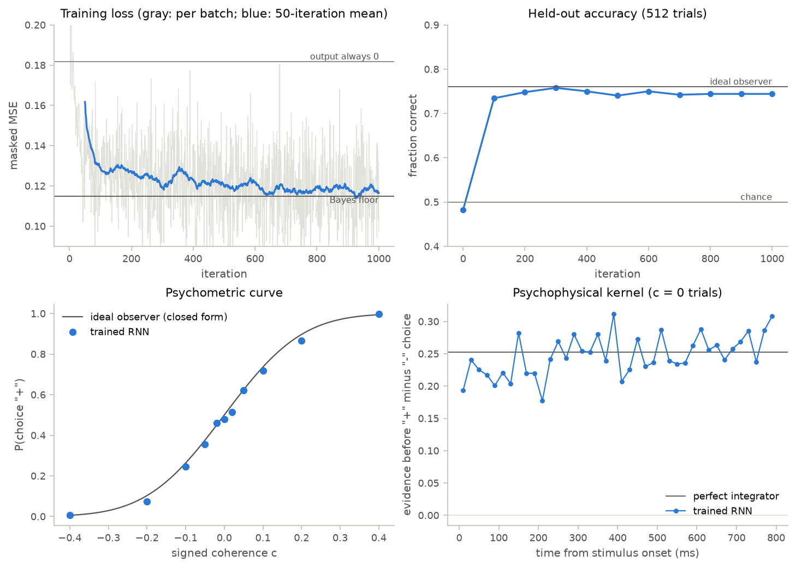
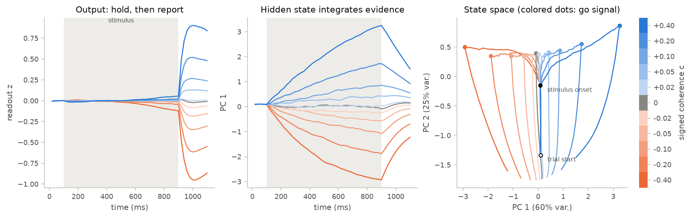

# 11 · Training a rate RNN with backpropagation through time

Course day 7, first half. Code: [`neuromodels/training/rnn.py`](../neuromodels/training/rnn.py),
[`scripts/11_rnn_training.py`](../scripts/11_rnn_training.py),
[`tests/test_training.py`](../tests/test_training.py).

Chapters 07–10 wired networks by hand. Here gradient descent sets every weight of
a recurrent network from examples of the desired behaviour (Song, Yang & Wang
2016), and the result is measured against the ideal observer of the task.

## Model

Rate units with currents $x$, rates $r = [x]_+$ and a linear readout $z$:

$$\tau\frac{dx}{dt} = -x + W_{rec}\,r + W_{in}\,u + b + \sqrt{2\tau}\,\sigma_{rec}\,\xi(t), \qquad z = W_{out}\,r + b_{out}$$

Euler steps with $\alpha = \Delta t/\tau$ (the $\sqrt{2\alpha}$ keeps the noise variance independent of $\Delta t$):

$$x_{t+1} = (1-\alpha)\,x_t + \alpha\,(W_{rec} r_t + W_{in} u_t + b) + \sqrt{2\alpha}\,\sigma_{rec}\,\mathcal N(0,1)$$

**Task.** Input 1 is a fixation cue whose offset is the go signal; input 2 is
momentary evidence $u_2 = c + \sigma_{in}\,\mathcal N(0,1)$ during the stimulus.
The target is $\hat z = 0$ until the go signal and $\operatorname{sign}(c)$ after
it; the loss is the squared error averaged over all steps and trials, and BPTT
is its gradient through the unrolled trial.

**Ideal observer.** The summed evidence $S \sim \mathcal N(nc,\, n\sigma_{in}^2)$ over
$n$ stimulus steps is sufficient for the sign of $c$, so $\operatorname{sign}(S)$
is optimal and

$$P_{correct}(c) = \Phi\!\left(\frac{|c|\sqrt n}{\sigma_{in}}\right), \qquad K_{ideal}(t) = 2\sigma_{in}\sqrt{\frac{2}{\pi n}}\ \ (c = 0),$$

where the psychophysical kernel $K(t)$ is the mean evidence fluctuation at step
$t$ before "+" choices minus that before "−" choices. It is flat for a perfect
integrator, rises toward the go signal for a leaky one and falls for bounded
integration. No network beats the **Bayes floor** of the loss, reached by
outputting the posterior mean $E[\operatorname{sign} c \mid S]$ after the go signal.

| parameter | value |
|---|---|
| units, activation | 64 (tests: 32), ReLU |
| $\tau$, $\Delta t$, $\sigma_{rec}$ | 100 ms, 20 ms ($\alpha = 0.2$), 0.05 |
| initial weights | $W_{in} \sim \mathcal N(0, 1/2)$, $W_{rec} \sim \mathcal N(0, 0.9^2/N)$, $W_{out} \sim \mathcal N(0, 1/N)$ |
| epochs | fixation 100, stimulus 800, decision 200 ms (55 steps) |
| $\lvert c\rvert$, $\sigma_{in}$ | 0.02, 0.05, 0.1, 0.2, 0.4 with random sign; 1 per step |
| training | Adam, lr $10^{-2}$ decaying exponentially to $2\times10^{-4}$; 1000 batches of 64 fresh trials |

## What the code does

- `DecisionTask.sample` draws time-major trials on the fly from a seeded NumPy
  generator; `ideal_accuracy`, `ideal_kernel`, `zero_output_loss` and
  `bayes_loss` (Monte Carlo) provide the yardsticks.
- `RateRNN` is a `bp.DynamicalSystem` built in `bm.TrainingMode`: three
  `bp.dnn.Dense` layers hold the weights as `bm.TrainVar`, the state carries a
  batch axis, and `update()` reads $\Delta t$ from `bp.share`.
- `simulate` unrolls a trial with `bm.for_loop`; `train` differentiates the loss
  with `bm.grad` (this is BPTT) and applies `bp.optim.Adam` with an
  `ExponentialDecayLR` schedule inside one `bm.jit`-compiled step.
- The script evaluates 4400 held-out trials and 4000 zero-coherence trials, then
  plots learning, behaviour and PCA of condition-averaged hidden states.

| result (script, float32) | value |
|---|---|
| loss, first 10 → last 50 batches | 0.218 → 0.116 (always-0 output 0.182, Bayes floor 0.115) |
| held-out accuracy, $c \ne 0$ | 0.758; ideal observer on the same trials 0.765 |
| $P(\text{"+"})$ at $c = 0$ | 0.48 |
| kernel, first / second half of the stimulus | 0.239 / 0.256 (perfect integrator 0.252) |
| variance in PC 1 / PC 2 | 60% / 25% |
| training time | ~19 s (4-core CPU) |

## Findings

- **The loss floor is set by the evidence, not by the network.** The last 50
  training batches average 0.116 against a Bayes floor of 0.115: almost all of
  the remaining error is the uncertainty of the ideal observer itself.
- **Recurrence builds a slow integrator from fast units.** A lone unit keeps a
  fraction $e^{-6}$ of evidence seen 600 ms earlier, yet the kernel is flat over
  800 ms: the evidence is held in a slow direction of the recurrent dynamics.
- **Integration happens out of the readout's sight.** PC 1 ramps with a slope
  proportional to $c$ while $z$ stays near 0; after the go signal the state moves
  into a direction the readout does see (dynamics figure).
- **Late small steps matter.** In a run with the same seeds and a constant lr of
  $5\times10^{-3}$, the network ended with a choice bias ($P(\text{"+"}) = 0.43$
  at $c = 0$) and a recency-weighted kernel (0.22 / 0.27); decaying the step
  size removed both.
- **BrainPy 2.8.** `bp.share.save(dt=...)` writes the global `dt`, so `bp.DSRunner`
  and `bp.BPTT` leave `bm.get_dt()` changed after they run; `simulate` scopes it
  with `bm.environment(dt=...)`. `bp.BPTT(model, loss_fun, optimizer).fit(...)`
  trains this model too, but prints a report every epoch.

## What the tests verify

- The simulated ideal observer matches $\Phi(\lvert c\rvert\sqrt n/\sigma_{in})$ within
  0.01 and its zero-coherence kernel matches $K_{ideal}$ within 3%.
- A 32-unit network trained for 300 batches starts above the always-0 loss and
  closes at least half of the gap to the Bayes floor; its held-out accuracy
  exceeds 0.65 and lies within 0.06 of the ideal observer on the same trials.
- Its kernel exceeds $0.4\,K_{ideal}$ in both halves of the stimulus, which a
  network without working recurrent integration cannot do.
- The BPTT gradient equals central finite differences along random directions
  (relative error $< 10^{-6}$; float64, no noise).
- `simulate` leaves the global $\Delta t$ unchanged.

## Questions to think about

1. The floor is 0.115 however long the network trains. How would it move if the
   stimulus lasted 1600 ms, and what does $\Phi(\lvert c\rvert\sqrt n/\sigma_{in})$ say
   about the gain in accuracy at $\lvert c\rvert = 0.02$ versus $0.4$?
2. The loss also penalises any output during the stimulus. What would the trained
   network be free to do if that penalty were dropped, and would PC 1 still be
   hidden from $W_{out}$?
3. Linearise the trained dynamics around the fixation state. Which eigenvalue of
   the step map $(1-\alpha)I + \alpha W_{rec}D$ must sit near 1 for a flat kernel,
   and what kernel shape appears if it is 0.97 instead?
4. BPTT multiplies 55 such step Jacobians. Why does the initial gain $g = 0.9$
   matter for the first gradients, and what would $g = 1.5$ risk?
