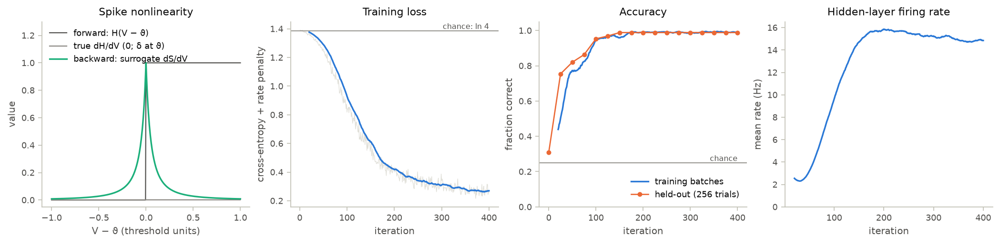
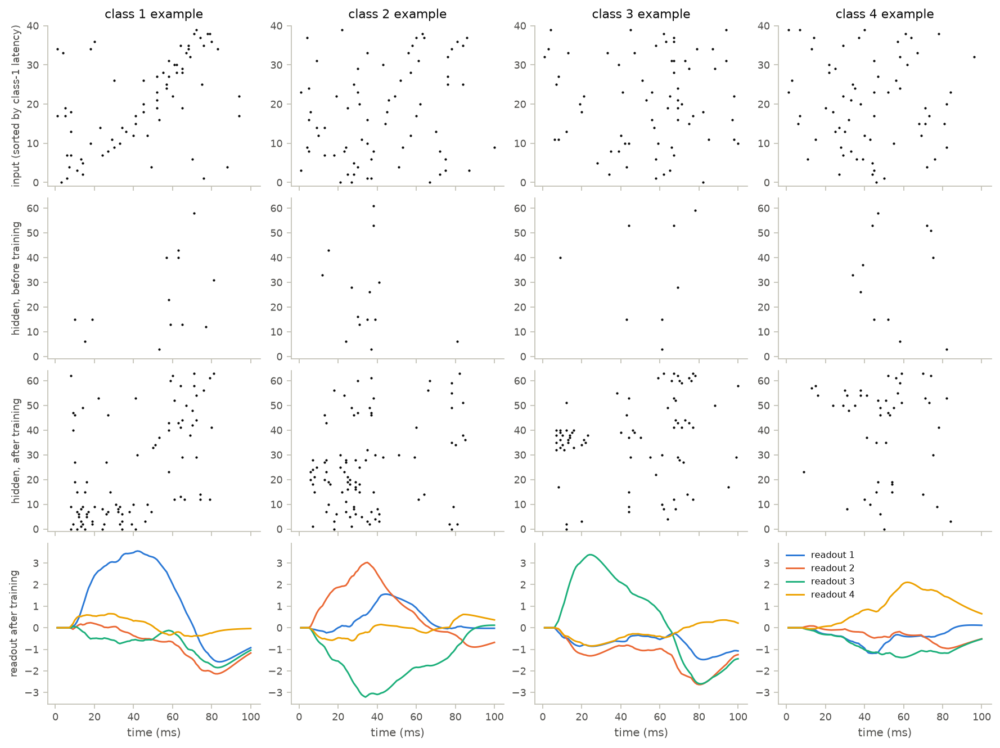

# 12 · Training a spiking network with surrogate gradients

Course day 7, second half. Code: [`neuromodels/training/snn.py`](../neuromodels/training/snn.py),
[`scripts/12_snn_training.py`](../scripts/12_snn_training.py),
[`tests/test_training.py`](../tests/test_training.py).

The BPTT loop of chapter 11 stalls on spiking neurons: a spike is a step function
of the membrane potential, so its derivative is zero almost everywhere.
Surrogate-gradient learning (Neftci, Mostafa & Zenke 2019) keeps the step in the
forward pass and substitutes a smooth pseudo-derivative in the backward pass.

## Model

Hidden LIF neurons in dimensionless units (rest 0, threshold $\vartheta = 1$),
driven through current-based exponential synapses by input spike trains
$S^{in}_j(t) = \sum_k \delta(t - t_j^k)$:

$$\frac{dI_i}{dt} = -\frac{I_i}{\tau_{syn}} + \sum_j W^{in}_{ij} S^{in}_j(t), \qquad \tau_{mem}\frac{dV_i}{dt} = -V_i + I_i, \qquad S_i = H(V_i - \vartheta),\ \ V_i \to V_i - \vartheta S_i$$

A second synaptic stage feeds leaky readout units, $\tau_{out}\dot U_k = -U_k + I^{out}_k$.
The class score is $s_k = \max_t U_k(t)$, and with $n_i$ the spike count of hidden
neuron $i$ in a trial the loss is

$$L = -\log\frac{e^{s_y}}{\sum_k e^{s_k}} + \lambda\,\overline{n_i^2}.$$

The chain rule needs $\partial S/\partial V = \delta(V - \vartheta)$, which is zero
everywhere except at threshold. The backward pass uses the SuperSpike fast-sigmoid
derivative instead (Zenke & Ganguli 2018):

$$\frac{\partial S}{\partial V} \;\longrightarrow\; \frac{1}{(\beta\,\lvert V - \vartheta\rvert + 1)^2}.$$

**Task.** Each class is a template of one spike per input at a class-specific
latency. A trial jitters every template spike and adds class-independent Poisson
background, so spike counts carry no class information; only relative timing
does (a tempotron-style task; Gütig & Sompolinsky 2006).

| parameter | value |
|---|---|
| inputs, classes, trial | 40, 4, 100 ms at $\Delta t = 1$ ms |
| template latencies | uniform in 5–75 ms, drawn once |
| jitter, background | 5 ms SD, 10 Hz |
| hidden layer; $\tau_{mem}$, $\tau_{syn}$, $\tau_{out}$ | 64 LIF (tests: 16–32), soft reset; 10, 5, 20 ms |
| initial weights | $W^{in} \sim \mathcal N(0, 3^2/40)$, $W^{out} \sim \mathcal N(0, 1/64)$ |
| surrogate steepness $\beta$, rate penalty $\lambda$ | 10, 0.02 |
| training | Adam, lr $5\times10^{-3}$ decaying to $5\times10^{-4}$; 400 batches of 64 |

## What the code does

- `LatencyTask` draws the templates once from its seed; `sample` jitters them,
  clips them into the trial and adds background spikes (time-major 0/1 arrays).
- `SpikingClassifier` chains built-in layers in `bm.TrainingMode`:
  `bp.dnn.Dense` → `bp.dyn.Expon` → `bp.dyn.Lif(spk_fun=bm.surrogate.InvSquareGrad(alpha=β))`
  → `bp.dnn.Dense` → `bp.dyn.Expon` → `bp.dyn.Integrator`. In training mode
  `Lif` emits float spikes `spk_fun(V − V_th)` and resets softly.
- `simulate`, `train` and `predict` mirror chapter 11. `heaviside` gives the same
  forward pass with the true derivative; `spike_derivative` evaluates $dS/dV$ with `bm.vector_grad`.
- The script compares input-weight gradients at initialisation, trains, and plots
  learning curves and rasters of one trial per class before and after training.

| result (script, float32) | value |
|---|---|
| $\lVert\partial L/\partial W^{in}\rVert$ at initialisation | surrogate 0.0128; true derivative exactly 0 |
| loss, first 10 → last 20 batches | 1.385 → 0.270 (chance $\ln 4 = 1.386$) |
| held-out accuracy (1000 trials) | 0.986; nearest-centroid on input spike counts 0.244 (chance 0.25) |
| hidden firing rate | 2.8 Hz → 14.8 Hz |
| training time | ~8 s (4-core CPU) |

## Findings

- **The true gradient vanishes upstream of the spikes.** With $H'$ the input
  weights receive exactly zero gradient while the readout weights still learn:
  the hidden layer could never change what it responds to.
- **Silent neurons learn.** Before training the layer fires at ~3 Hz; on a
  typical trial 79% of the neurons stay silent. The pseudo-derivative is positive
  below threshold, so they still receive credit, and after training none is silent.
- **Timing, not counts.** A classifier of input spike counts sits at chance while
  the network reaches 0.986: after training, hidden neurons respond to
  class-specific groups of near-coincident input spikes (sorted rasters).
- **Cross-entropy buys margin with spikes.** Without the rate penalty the same
  run reaches 0.992 at 51 Hz; $\lambda = 0.02$ holds the layer at 15 Hz for 0.6
  points of accuracy.
- **BrainPy 2.8.** `bm.surrogate` is `braintools.surrogate`; its spike functions
  take JAX arrays (a `bm.Array` raises an abstractification error).
  `bp.dyn.Lif(detach_spk=True)` detaches the returned spike as well as the reset,
  blocking all learning upstream (`LifRef` detaches only the reset); the code
  keeps the default, so the reset also carries surrogate gradient.

## What the tests verify

- Without background every input fires exactly once per trial, and a
  nearest-template classifier on spike times is more than 99% correct.
- The surrogate's forward pass equals $H$; the true derivative is 0 at every
  $x \ne 0$; the surrogate derivative equals $1/(10\lvert x\rvert + 1)^2$.
- Surrogate and true-derivative networks with equal weights give identical spikes
  and loss; only the true derivative leaves the input-weight gradient exactly 0,
  and the surrogate credits every neuron that never fired.
- 32 hidden neurons trained for 150 batches on a 3-class task: the loss falls
  from above $0.9\ln 3$ to below $0.4\ln 3$, and held-out accuracy exceeds 0.8
  (chance 1/3).

## Questions to think about

1. As $\beta \to \infty$ the surrogate vanishes everywhere except at threshold,
   like $H'$ (its area is $2/\beta$); as $\beta \to 0$ it becomes a constant.
   What fails in each limit, and which neurons lose credit first as $\beta$ grows?
2. The soft reset $V \to V - \vartheta S$ also passes surrogate gradient. Write
   $\partial V_{t+1}/\partial V_t$ for a step in which $V$ lands just above
   threshold ($\beta = 10$, $\vartheta = 1$). Why does it nearly vanish, and why
   do many implementations detach the reset?
3. The score is $\max_t U_k(t)$. What would the network learn if it were the
   time average of $U_k$, and which choice suits a class decided by the last
   spikes of the trial?
4. Hidden neurons detect coincidences within a window set by $\tau_{syn}$ and
   $\tau_{mem}$. What should happen to accuracy if the jitter grows from 5 to
   15 ms, and which time constant would you change first?
