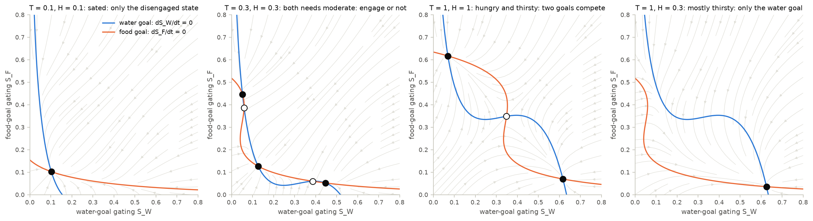
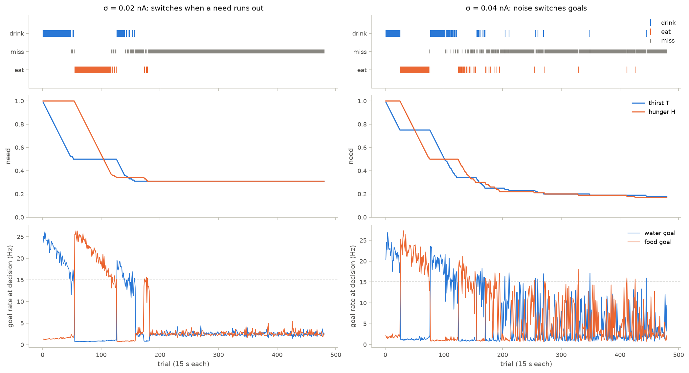
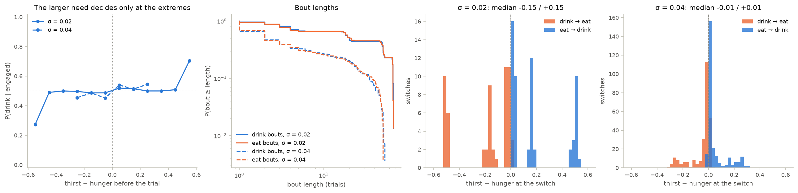

# 13 · Drink or eat? A rate model of need-based choice

Beyond the course. Code: [`neuromodels/networks/need_choice.py`](../neuromodels/networks/need_choice.py),
[`scripts/13_need_choice.py`](../scripts/13_need_choice.py),
[`tests/test_need_choice.py`](../tests/test_need_choice.py).

Richman et al. (2023) offered mice that were both hungry and thirsty water or food on
every trial. The mice collected need-appropriate rewards in persistent bouts with
stochastic transitions, and the authors described the goal state as diffusing across an
energy landscape that shifts as needs change. This chapter asks whether a known circuit,
the decision network of chapter 08, produces the same behaviour when slow need signals
replace the motion stimulus.

## Model

Goal populations W (drink) and F (eat), reduced Wong & Wang (2006) dynamics:

$$\frac{dS_i}{dt} = -\frac{S_i}{\tau_S} + (1 - S_i)\,\gamma H(x_i), \qquad
x_W = J_{same} S_W - J_{cross} S_F + I_0 + J_{ext}\,\mu_{max}\,T + n_W$$

and likewise for $x_F$ with hunger $H$. Thirst $T$ and hunger $H$ lie in $[0, 1]$; $n_i$ is
Ornstein–Uhlenbeck noise ($\tau_{AMPA}$ = 2 ms, stationary SD $\sigma/\sqrt2$). Each trial
the mouse takes the goal whose noise-free rate exceeds 15 Hz (the larger if both do) and
otherwise misses. Each reward lowers its need, $T \to T - \delta_W$ or $H \to H - \delta_F$.

| parameter | value | status |
|---|---|---|
| $J_{same}$ | 0.24 nA | chosen: goals exist only while driven (chapter 08: 0.2609) |
| other circuit constants | Wong & Wang (2006) | as in chapter 08 |
| noise $\sigma$ | 0.04 nA | placeholder (0.02 nA in chapter 08 almost never switches goals) |
| full-need drive $\mu_{max}$ | 40 Hz | placeholder |
| need drop per reward $\delta_W, \delta_F$ | 0.01 | placeholder |
| trial interval | 15 s, 480 trials = 2 h | placeholder |
| integration | $dt$ = 1 ms, exact OU steps | chosen |

## What the code does

- `goal_states(T, H)` maps the needs onto chapter 08's stimulus terms
  ($\mu_0 = \mu_{max}(T + H)/2$, $c' = 100\,(T - H)/(T + H)$) and returns the fixed points.
- `NeedChoice` holds one session per unit. Its `update()` is a whole trial: a nested
  `bm.for_loop` advances the circuit through 15 000 steps of 1 ms, then the model reads out
  the choice and consumes the reward. Monitors therefore stay trial-sized, like the data.
- `stay_probabilities`, `bout_lengths` and `switch_needs` compute the statistics used below.

## Findings (model only; no data yet)

| needs | stable states |
|---|---|
| none, or both ≤ 0.2 | disengaged only |
| both 0.3 | disengaged and two goals |
| both 0.6–1 | two goals |
| T = 1, H ≤ 0.3 | water goal only |

| 32 sessions of 2 h | σ = 0.02 nA | σ = 0.04 nA |
|---|---|---|
| stay after drinking / eating | 0.974 / 0.974 | 0.901 / 0.902 |
| same choices shuffled | 0.49 / 0.49 | 0.49 / 0.49 |
| mean bout length | 30 trials | 10 trials |
| rewards (water / food) | 70 / 70 | 82 / 82 |
| needs left at the end | 0.30 | 0.18 |
| T − H at switches (to eat / to drink) | −0.15 / +0.15 | −0.01 / +0.01 |

- **Bouts come from attractors, and satiety from their loss.** A goal state persists
  because the circuit is bistable. The session ends when the needs fall below the level
  that can sustain any goal.
- **Two ways to end a bout.** At low noise a bout ends only when its need has fallen well
  below the other: hysteresis, largest at the start of the session (switches at
  T − H = ±0.5), then shrinking (±0.2, then 0). At higher noise, switches happen where the
  needs are about equal.
- **History outweighs small need differences.** Within ±0.25 (σ = 0.04) or ±0.45
  (σ = 0.02), P(drink) stays near 0.5: which goal the mouse pursues depends on the bout it
  is in, not on which need is larger.

## Next step: the data

Richman et al. (2023) shared spike-sorted Neuropixels recordings with the behaviour
(Springer Nature Figshare, article 24153348; about 11 GB). The planned fit:

1. From each session's choices, estimate needs from cumulative intake.
2. Fit $\sigma$, $\mu_{max}$ and $\delta$ (and possibly $J_{same}$) by simulation, matching
   stay probabilities, bout-length distributions and switch-point need differences.
3. Test the hysteresis prediction: do water-to-food switches happen at a different need
   imbalance than food-to-water switches?
4. Compare the recorded goal-state neurons with $S_W$ and $S_F$.

## What the tests verify

- The need-to-stimulus mapping, and the fixed-point regimes above: sated means disengaged
  only; hungry and thirsty means two goals; mostly thirsty means the water goal only.
- Chapter 08's recurrence (0.2609 nA) would keep goal states at zero need; 0.24 nA does not.
- Hand-made sequences check the bout statistics. Sessions are reproducible from a seed,
  choices are more persistent than shuffled choices by more than 0.3, needs fall by
  exactly δ per reward, and engagement drops from above 90 % to below 20 %.
- A mostly thirsty mouse drinks first. Low noise gives switch-point medians beyond ±0.08;
  higher noise gives medians within ±0.05.

## Questions to think about

1. Richman et al.'s landscape model also produces bouts. Which measurement would tell a
   two-attractor circuit from diffusion on a landscape? Consider hysteresis, how switch
   rates depend on the overall need level, and the effect of a brief push to one goal.
2. The model stops with 20–30 % of each need unserved. Is that satiety or an artifact of
   the 15 Hz threshold and $J_{same}$? Which data would say?
3. Needs here fall only after consumption, but hunger (AgRP) and thirst (SFO) neurons drop
   within seconds of sensing food or water (Chen et al. 2015; Zimmerman et al. 2016). How
   would such anticipatory feedback change bout lengths?
4. $\sigma$ trades noise-driven switching against hysteresis. Which single feature of the
   data would pin it down best?

## References

Richman EB, Ticea N, Allen WE, Deisseroth K, Luo L (2023) Neural landscape diffusion
resolves conflicts between needs across time. Nature 623:571–579.
Wong K-F, Wang X-J (2006) J Neurosci 26:1314–1328.
Chen Y, Lin Y-C, Kuo T-W, Knight ZA (2015) Sensory detection of food rapidly modulates
arcuate feeding circuits. Cell 160:829–841.
Zimmerman CA, Lin Y-C, Leib DE, et al. (2016) Thirst neurons anticipate the homeostatic
consequences of eating and drinking. Nature 537:680–684.
